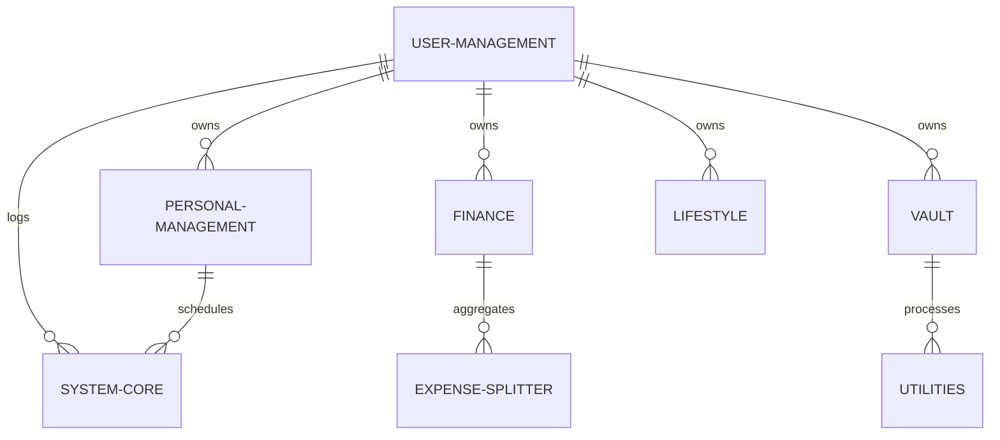
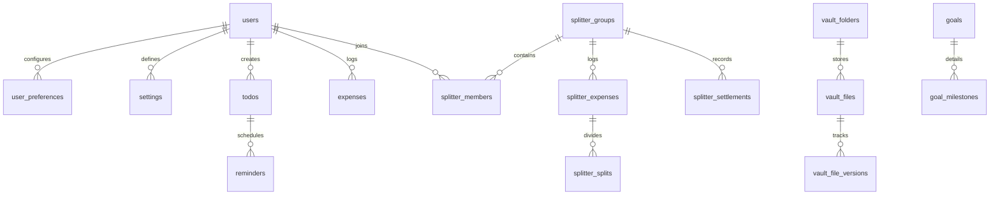

# Database Design Document (DDD)
## Project Name: DevMate — The Telegram-based Personal Operating System

---

## 1. Conceptual ERD (Module Relationships)

This conceptual ERD illustrates the logical data boundaries and associations between the core functional modules of the DevMate platform.

---

## 2. Logical ERD (Table Relationships)

The logical diagram maps table-level keys and constraints. Foreign key joins are restricted to intra-module boundaries, using logical IDs for cross-module mapping.

---

## 3. Complete Table Dictionary

All UUID data types are stored as `VARCHAR(36)` strings. All timestamps default to UTC and are defined as `TIMESTAMP WITH TIME ZONE`.

### 3.1 Module: User Management & Core Settings

#### Table: `users`
* **Purpose:** Core user profiles registry.
* **Owner Module:** User Management.
* **Primary Key:** `id` VARCHAR(36) UUID

| Column | Datatype | Nullable | Default | Unique | Description |
| :--- | :--- | :--- | :--- | :--- | :--- |
| `id` | VARCHAR(36) | No | None | Yes | Primary UUID identifier |
| `telegram_id` | BIGINT | No | None | Yes | Immutable Telegram User ID |
| `username` | VARCHAR(100)| Yes | NULL | No | Telegram username |
| `first_name` | VARCHAR(150)| No | None | No | Telegram first name |
| `last_name` | VARCHAR(150)| Yes | NULL | No | Telegram last name |
| `status` | VARCHAR(30) | No | 'Active' | No | Account status (Active/Suspended) |
| `created_at` | TIMESTAMP | No | NOW() | No | Creation audit timestamp |
| `updated_at` | TIMESTAMP | No | NOW() | No | Last update audit timestamp |
| `deleted_at` | TIMESTAMP | Yes | NULL | No | Soft-delete check marker |

* **Indexes:**
  * Unique Index: `idx_users_telegram_id` ON `telegram_id`
* **Check Constraints:**
  * `chk_users_status`: `status` IN ('Pending Onboarding', 'Active', 'Suspended', 'Deactivated')

---

#### Table: `user_preferences`
* **Purpose:** Store localized UI formats.
* **Owner Module:** User Management.
* **Primary Key:** `id` VARCHAR(36) UUID

| Column | Datatype | Nullable | Default | Unique | Description |
| :--- | :--- | :--- | :--- | :--- | :--- |
| `id` | VARCHAR(36) | No | None | Yes | Primary identifier |
| `user_id` | VARCHAR(36) | No | None | Yes | Associated user ID |
| `base_currency` | VARCHAR(3)  | No | 'USD' | No | Base currency ISO code |
| `timezone` | VARCHAR(100)| No | 'UTC' | No | Localized timezone identifier |
| `language` | VARCHAR(5)  | No | 'en' | No | Localization language code |

* **Foreign Keys:**
  * `fk_user_preferences_users`: `user_id` REFERENCES `users(id)` ON DELETE CASCADE

---

#### Table: `settings`
* **Purpose:** Define user-specific application switches.
* **Owner Module:** Settings.
* **Primary Key:** `id` VARCHAR(36) UUID

| Column | Datatype | Nullable | Default | Unique | Description |
| :--- | :--- | :--- | :--- | :--- | :--- |
| `id` | VARCHAR(36) | No | None | Yes | Primary identifier |
| `user_id` | VARCHAR(36) | No | None | Yes | Associated user ID |
| `quiet_hours_start`| VARCHAR(5)  | Yes | NULL | No | Start of quiet window (HH:MM) |
| `quiet_hours_end`  | VARCHAR(5)  | Yes | NULL | No | End of quiet window (HH:MM) |
| `summary_time` | VARCHAR(5)  | No | '08:00'| No | Delivery time for daily briefs |
| `notify_enabled` | BOOLEAN | No | TRUE | No | Master notification switch |

* **Foreign Keys:**
  * `fk_settings_users`: `user_id` REFERENCES `users(id)` ON DELETE CASCADE

---

### 3.2 Module: Personal Management (PMM)

#### Table: `todos`
* **Purpose:** Individual checklist items.
* **Owner Module:** Todo.
* **Primary Key:** `id` VARCHAR(36) UUID

| Column | Datatype | Nullable | Default | Unique | Description |
| :--- | :--- | :--- | :--- | :--- | :--- |
| `id` | VARCHAR(36) | No | None | Yes | Primary identifier |
| `user_id` | VARCHAR(36) | No | None | No | Creator ID |
| `title` | VARCHAR(255)| No | None | No | Task name description |
| `priority` | VARCHAR(15) | No | 'Medium' | No | Priority level classification |
| `status` | VARCHAR(30) | No | 'Pending'| No | Task execution status |
| `due_date` | TIMESTAMP | Yes | NULL | No | Expiration deadline |
| `created_at` | TIMESTAMP | No | NOW() | No | Creation stamp |
| `updated_at` | TIMESTAMP | No | NOW() | No | Update stamp |
| `deleted_at` | TIMESTAMP | Yes | NULL | No | Soft delete marker |

* **Foreign Keys:**
  * `fk_todos_users`: `user_id` REFERENCES `users(id)` ON DELETE CASCADE
* **Check Constraints:**
  * `chk_todos_priority`: `priority` IN ('Low', 'Medium', 'High')
  * `chk_todos_status`: `status` IN ('Pending', 'In-Progress', 'Completed', 'Overdue')

---

#### Table: `reminders`
* **Purpose:** Scheduled alert parameters.
* **Owner Module:** Reminders.
* **Primary Key:** `id` VARCHAR(36) UUID

| Column | Datatype | Nullable | Default | Unique | Description |
| :--- | :--- | :--- | :--- | :--- | :--- |
| `id` | VARCHAR(36) | No | None | Yes | Primary identifier |
| `user_id` | VARCHAR(36) | No | None | No | Creator ID |
| `associated_todo_id`| VARCHAR(36)| Yes | NULL | No | Linked todo task ID (optional) |
| `text` | VARCHAR(500)| No | None | No | Alert payload message |
| `trigger_time` | TIMESTAMP | No | None | No | Execution target timestamp |
| `recurrence` | VARCHAR(200)| Yes | NULL | No | iCal RFC 5545 recurrence rule |
| `snooze_minutes` | INT | No | 0 | No | Active snooze window count |
| `status` | VARCHAR(30) | No | 'Active' | No | Execution state |
| `created_at` | TIMESTAMP | No | NOW() | No | Creation stamp |
| `updated_at` | TIMESTAMP | No | NOW() | No | Update stamp |
| `deleted_at` | TIMESTAMP | Yes | NULL | No | Soft delete marker |

* **Foreign Keys:**
  * `fk_reminders_users`: `user_id` REFERENCES `users(id)` ON DELETE CASCADE
* **Check Constraints:**
  * `chk_reminders_status`: `status` IN ('Pending', 'Fired', 'Missed', 'Snoozed', 'Paused', 'Completed')

---

#### Table: `goals`
* **Purpose:** Long-term target tracking.
* **Owner Module:** Goals.
* **Primary Key:** `id` VARCHAR(36) UUID

| Column | Datatype | Nullable | Default | Unique | Description |
| :--- | :--- | :--- | :--- | :--- | :--- |
| `id` | VARCHAR(36) | No | None | Yes | Primary identifier |
| `user_id` | VARCHAR(36) | No | None | No | Creator ID |
| `title` | VARCHAR(255)| No | None | No | Goal name description |
| `target_date` | TIMESTAMP | No | None | No | Target milestone date |
| `progress` | INT | No | 0 | No | Percentage progress (0-100) |
| `status` | VARCHAR(30) | No | 'Draft'  | No | Active state |
| `created_at` | TIMESTAMP | No | NOW() | No | Creation stamp |
| `deleted_at` | TIMESTAMP | Yes | NULL | No | Soft delete marker |

* **Foreign Keys:**
  * `fk_goals_users`: `user_id` REFERENCES `users(id)` ON DELETE CASCADE
* **Check Constraints:**
  * `chk_goals_progress`: `progress` BETWEEN 0 AND 100

---

#### Table: `goal_milestones`
* **Purpose:** Goal milestones.
* **Owner Module:** Goals.
* **Primary Key:** `id` VARCHAR(36) UUID

| Column | Datatype | Nullable | Default | Unique | Description |
| :--- | :--- | :--- | :--- | :--- | :--- |
| `id` | VARCHAR(36) | No | None | Yes | Primary identifier |
| `goal_id` | VARCHAR(36) | No | None | No | Parent goal link |
| `title` | VARCHAR(255)| No | None | No | Milestone title |
| `is_completed` | BOOLEAN | No | FALSE | No | Completion status |

* **Foreign Keys:**
  * `fk_milestones_goals`: `goal_id` REFERENCES `goals(id)` ON DELETE CASCADE

---

### 3.3 Module: Finance & Subscriptions

#### Table: `expenses`
* **Purpose:** Logged individual financial transactions.
* **Owner Module:** Expense Tracker.
* **Primary Key:** `id` VARCHAR(36) UUID

| Column | Datatype | Nullable | Default | Unique | Description |
| :--- | :--- | :--- | :--- | :--- | :--- |
| `id` | VARCHAR(36) | No | None | Yes | Primary identifier |
| `user_id` | VARCHAR(36) | No | None | No | Log owner |
| `amount` | DECIMAL(18,4)| No | None | No | Transaction value amount |
| `currency` | VARCHAR(3)  | No | None | No | Transaction currency code |
| `description` | VARCHAR(255)| No | None | No | Expense notes |
| `category` | VARCHAR(100)| No | 'General'| No | Categorization directory index |
| `is_recurring` | BOOLEAN | No | FALSE | No | Recurring status flag |
| `created_at` | TIMESTAMP | No | NOW() | No | Transaction execution stamp |
| `deleted_at` | TIMESTAMP | Yes | NULL | No | Soft delete marker |

* **Foreign Keys:**
  * `fk_expenses_users`: `user_id` REFERENCES `users(id)` ON DELETE CASCADE

---

#### Table: `loans`
* **Purpose:** Debt liability records.
* **Owner Module:** Expense Tracker.
* **Primary Key:** `id` VARCHAR(36) UUID

| Column | Datatype | Nullable | Default | Unique | Description |
| :--- | :--- | :--- | :--- | :--- | :--- |
| `id` | VARCHAR(36) | No | None | Yes | Primary identifier |
| `user_id` | VARCHAR(36) | No | None | No | Owner |
| `principal` | DECIMAL(18,4)| No | None | No | Base loan principal value |
| `interest_rate` | DECIMAL(5,2) | No | 0.00 | No | Annual interest percentage |
| `duration_months`| INT | No | None | No | Loan term duration months |
| `start_date` | TIMESTAMP | No | None | No | Installment calculations start date |
| `status` | VARCHAR(30) | No | 'Active' | No | Payment execution status |
| `deleted_at` | TIMESTAMP | Yes | NULL | No | Soft delete marker |

* **Foreign Keys:**
  * `fk_loans_users`: `user_id` REFERENCES `users(id)` ON DELETE CASCADE

---

#### Table: `loan_emis`
* **Purpose:** Scheduled EMI amortization steps.
* **Owner Module:** Expense Tracker.
* **Primary Key:** `id` VARCHAR(36) UUID

| Column | Datatype | Nullable | Default | Unique | Description |
| :--- | :--- | :--- | :--- | :--- | :--- |
| `id` | VARCHAR(36) | No | None | Yes | Primary identifier |
| `loan_id` | VARCHAR(36) | No | None | No | Parent loan link |
| `amount` | DECIMAL(18,4)| No | None | No | Target monthly EMI value |
| `due_date` | TIMESTAMP | No | None | No | Target billing date |
| `status` | VARCHAR(30) | No | 'Pending'| No | Payment execution status |

* **Foreign Keys:**
  * `fk_emis_loans`: `loan_id` REFERENCES `loans(id)` ON DELETE CASCADE

---

#### Table: `subscriptions`
* **Purpose:** Active subscription details.
* **Owner Module:** Expense Tracker.
* **Primary Key:** `id` VARCHAR(36) UUID

| Column | Datatype | Nullable | Default | Unique | Description |
| :--- | :--- | :--- | :--- | :--- | :--- |
| `id` | VARCHAR(36) | No | None | Yes | Primary identifier |
| `user_id` | VARCHAR(36) | No | None | No | Owner |
| `name` | VARCHAR(150)| No | None | No | Subscription provider name |
| `amount` | DECIMAL(18,4)| No | None | No | Periodic cost amount |
| `currency` | VARCHAR(3)  | No | 'USD' | No | Cost currency ISO code |
| `cycle` | VARCHAR(30) | No | 'Monthly'| No | Renewal cycle interval |
| `next_billing` | TIMESTAMP | No | None | No | Target renewal date |
| `status` | VARCHAR(30) | No | 'Active' | No | Subscription status |
| `deleted_at` | TIMESTAMP | Yes | NULL | No | Soft delete marker |

* **Foreign Keys:**
  * `fk_subscriptions_users`: `user_id` REFERENCES `users(id)` ON DELETE CASCADE

---

### 3.4 Module: Expense Splitter (ESM)

#### Table: `splitter_groups`
* **Purpose:** Expense sharing groups.
* **Owner Module:** Expense Splitter.
* **Primary Key:** `id` VARCHAR(36) UUID

| Column | Datatype | Nullable | Default | Unique | Description |
| :--- | :--- | :--- | :--- | :--- | :--- |
| `id` | VARCHAR(36) | No | None | Yes | Primary identifier |
| `owner_id` | VARCHAR(36) | No | None | No | Group creator user ID |
| `name` | VARCHAR(100)| No | None | No | Group display name |
| `invite_token` | VARCHAR(64) | No | None | Yes | Secure join token payload |
| `status` | VARCHAR(30) | No | 'Active' | No | Group state status |
| `created_at` | TIMESTAMP | No | NOW() | No | Creation stamp |
| `deleted_at` | TIMESTAMP | Yes | NULL | No | Soft delete marker |

* **Foreign Keys:**
  * `fk_splitter_groups_users`: `owner_id` REFERENCES `users(id)` ON DELETE RESTRICT

---

#### Table: `splitter_members`
* **Purpose:** Group rosters mapper.
* **Owner Module:** Expense Splitter.
* **Primary Key:** `id` VARCHAR(36) UUID

| Column | Datatype | Nullable | Default | Unique | Description |
| :--- | :--- | :--- | :--- | :--- | :--- |
| `id` | VARCHAR(36) | No | None | Yes | Primary identifier |
| `group_id` | VARCHAR(36) | No | None | No | Group ID link |
| `user_id` | VARCHAR(36) | No | None | No | Group member user ID |
| `nickname` | VARCHAR(100)| Yes | NULL | No | Custom name within group ledger |
| `status` | VARCHAR(30) | No | 'Joined' | No | Membership state status |

* **Foreign Keys:**
  * `fk_members_groups`: `group_id` REFERENCES `splitter_groups(id)` ON DELETE CASCADE
  * `fk_members_users`: `user_id` REFERENCES `users(id)` ON DELETE RESTRICT
* **Indexes:**
  * Unique Index: `uq_members_group_user` ON (`group_id`, `user_id`)

---

#### Table: `splitter_expenses`
* **Purpose:** Shared transaction registry.
* **Owner Module:** Expense Splitter.
* **Primary Key:** `id` VARCHAR(36) UUID

| Column | Datatype | Nullable | Default | Unique | Description |
| :--- | :--- | :--- | :--- | :--- | :--- |
| `id` | VARCHAR(36) | No | None | Yes | Primary identifier |
| `group_id` | VARCHAR(36) | No | None | No | Group ID link |
| `payer_id` | VARCHAR(36) | No | None | No | Member ID of transaction payer |
| `amount` | DECIMAL(18,4)| No | None | No | Transaction value amount |
| `description` | VARCHAR(255)| No | None | No | Details description |
| `split_type` | VARCHAR(30) | No | 'Equal' | No | Calculation type |
| `created_at` | TIMESTAMP | No | NOW() | No | Log execution timestamp |
| `deleted_at` | TIMESTAMP | Yes | NULL | No | Soft delete marker |

* **Foreign Keys:**
  * `fk_splitter_expenses_groups`: `group_id` REFERENCES `splitter_groups(id)` ON DELETE CASCADE
  * `fk_splitter_expenses_payer`: `payer_id` REFERENCES `splitter_members(id)` ON DELETE RESTRICT

---

#### Table: `splitter_splits`
* **Purpose:** Individual share mapping for shared transactions.
* **Owner Module:** Expense Splitter.
* **Primary Key:** `id` VARCHAR(36) UUID

| Column | Datatype | Nullable | Default | Unique | Description |
| :--- | :--- | :--- | :--- | :--- | :--- |
| `id` | VARCHAR(36) | No | None | Yes | Primary identifier |
| `splitter_expense_id`| VARCHAR(36)| No | None | No | Parent transaction link |
| `member_id` | VARCHAR(36) | No | None | No | Group member user ID |
| `share_amount` | DECIMAL(18,4)| No | None | No | Calculated share debt |
| `share_percent`| DECIMAL(5,2) | Yes | NULL | No | Assigned percentage share |

* **Foreign Keys:**
  * `fk_splits_expenses`: `splitter_expense_id` REFERENCES `splitter_expenses(id)` ON DELETE CASCADE
  * `fk_splits_members`: `member_id` REFERENCES `splitter_members(id)` ON DELETE RESTRICT

---

#### Table: `splitter_settlements`
* **Purpose:** Settlement logs.
* **Owner Module:** Settlement.
* **Primary Key:** `id` VARCHAR(36) UUID

| Column | Datatype | Nullable | Default | Unique | Description |
| :--- | :--- | :--- | :--- | :--- | :--- |
| `id` | VARCHAR(36) | No | None | Yes | Primary identifier |
| `group_id` | VARCHAR(36) | No | None | No | Group ID link |
| `debtor_id` | VARCHAR(36) | No | None | No | Member ID of payer |
| `creditor_id` | VARCHAR(36) | No | None | No | Member ID of recipient |
| `amount` | DECIMAL(18,4)| No | None | No | Settle transaction amount |
| `status` | VARCHAR(30) | No | 'Proposed'| No | Verification status |
| `created_at` | TIMESTAMP | No | NOW() | No | Execution timestamp |
| `updated_at` | TIMESTAMP | No | NOW() | No | Verification update timestamp |

* **Foreign Keys:**
  * `fk_settle_groups`: `group_id` REFERENCES `splitter_groups(id)` ON DELETE CASCADE
  * `fk_settle_debtor`: `debtor_id` REFERENCES `splitter_members(id)` ON DELETE RESTRICT
  * `fk_settle_creditor`: `creditor_id` REFERENCES `splitter_members(id)` ON DELETE RESTRICT

---

### 3.5 Module: Personal Vault (PVM)

#### Table: `vault_folders`
* **Purpose:** Folder structures within the secure vault.
* **Owner Module:** File Vault.
* **Primary Key:** `id` VARCHAR(36) UUID

| Column | Datatype | Nullable | Default | Unique | Description |
| :--- | :--- | :--- | :--- | :--- | :--- |
| `id` | VARCHAR(36) | No | None | Yes | Primary identifier |
| `user_id` | VARCHAR(36) | No | None | No | Owner user ID |
| `parent_id` | VARCHAR(36) | Yes | NULL | No | Parent folder ID (null if root) |
| `name` | VARCHAR(150)| No | None | No | Folder name |
| `created_at` | TIMESTAMP | No | NOW() | No | Creation stamp |
| `deleted_at` | TIMESTAMP | Yes | NULL | No | Soft delete marker |

* **Foreign Keys:**
  * `fk_folders_users`: `user_id` REFERENCES `users(id)` ON DELETE CASCADE
  * `fk_folders_parent`: `parent_id` REFERENCES `vault_folders(id)` ON DELETE CASCADE

---

#### Table: `vault_files`
* **Purpose:** File metadata logs.
* **Owner Module:** File Vault.
* **Primary Key:** `id` VARCHAR(36) UUID

| Column | Datatype | Nullable | Default | Unique | Description |
| :--- | :--- | :--- | :--- | :--- | :--- |
| `id` | VARCHAR(36) | No | None | Yes | Primary identifier |
| `user_id` | VARCHAR(36) | No | None | No | Owner user ID |
| `folder_id` | VARCHAR(36) | Yes | NULL | No | Parent folder link (null if root) |
| `name` | VARCHAR(255)| No | None | No | File name |
| `storage_path`| VARCHAR(500)| No | None | No | Object storage directory path |
| `file_size` | BIGINT | No | None | No | File size in bytes |
| `extension` | VARCHAR(15) | No | None | No | File extension |
| `is_favorite` | BOOLEAN | No | FALSE | No | Favorite status flag |
| `is_pinned` | BOOLEAN | No | FALSE | No | Pinned status flag |
| `checksum` | VARCHAR(64) | No | None | No | File hash verification value |
| `status` | VARCHAR(30) | No | 'Scanning'| No | Security checks status |
| `created_at` | TIMESTAMP | No | NOW() | No | Creation stamp |
| `deleted_at` | TIMESTAMP | Yes | NULL | No | Soft delete marker |

* **Foreign Keys:**
  * `fk_files_users`: `user_id` REFERENCES `users(id)` ON DELETE CASCADE
  * `fk_files_folders`: `folder_id` REFERENCES `vault_folders(id)` ON DELETE SET NULL

---

#### Table: `vault_file_versions`
* **Purpose:** File version history tracking.
* **Owner Module:** File Vault.
* **Primary Key:** `id` VARCHAR(36) UUID

| Column | Datatype | Nullable | Default | Unique | Description |
| :--- | :--- | :--- | :--- | :--- | :--- |
| `id` | VARCHAR(36) | No | None | Yes | Primary identifier |
| `file_id` | VARCHAR(36) | No | None | No | Parent file metadata link |
| `version` | INT | No | 1 | No | Version step number |
| `storage_path`| VARCHAR(500)| No | None | No | Version storage path |
| `file_size` | BIGINT | No | None | No | Version size bytes |
| `checksum` | VARCHAR(64) | No | None | No | Version verification hash |
| `created_at` | TIMESTAMP | No | NOW() | No | Upload execution timestamp |

* **Foreign Keys:**
  * `fk_versions_files`: `file_id` REFERENCES `vault_files(id)` ON DELETE CASCADE

---

#### Table: `vault_secure_notes`
* **Purpose:** Encrypted personal notes storage.
* **Owner Module:** Secure Notes.
* **Primary Key:** `id` VARCHAR(36) UUID

| Column | Datatype | Nullable | Default | Unique | Description |
| :--- | :--- | :--- | :--- | :--- | :--- |
| `id` | VARCHAR(36) | No | None | Yes | Primary identifier |
| `user_id` | VARCHAR(36) | No | None | No | Owner |
| `title` | VARCHAR(150)| No | None | No | Searchable title |
| `ciphertext` | TEXT | No | None | No | Encrypted content payload |
| `created_at` | TIMESTAMP | No | NOW() | No | Creation stamp |
| `deleted_at` | TIMESTAMP | Yes | NULL | No | Soft delete marker |

* **Foreign Keys:**
  * `fk_secnotes_users`: `user_id` REFERENCES `users(id)` ON DELETE CASCADE

---

#### Table: `vault_passwords`
* **Purpose:** Encrypted credentials profiles.
* **Owner Module:** Password Vault.
* **Primary Key:** `id` VARCHAR(36) UUID

| Column | Datatype | Nullable | Default | Unique | Description |
| :--- | :--- | :--- | :--- | :--- | :--- |
| `id` | VARCHAR(36) | No | None | Yes | Primary identifier |
| `user_id` | VARCHAR(36) | No | None | No | Owner |
| `title` | VARCHAR(150)| No | None | No | Searchable account name |
| `domain` | VARCHAR(255)| Yes | NULL | No | Target domain URL |
| `username` | VARCHAR(150)| No | None | No | Login username details |
| `ciphertext` | TEXT | No | None | No | Encrypted password payload |
| `created_at` | TIMESTAMP | No | NOW() | No | Creation stamp |
| `deleted_at` | TIMESTAMP | Yes | NULL | No | Soft delete marker |

* **Foreign Keys:**
  * `fk_passwords_users`: `user_id` REFERENCES `users(id)` ON DELETE CASCADE

---

### 3.6 Module: Shared System & Core Registry

#### Table: `audit_logs`
* **Purpose:** Immutable registry of security and administrative operations.
* **Owner Module:** Audit Logs.
* **Primary Key:** `id` VARCHAR(36) UUID

| Column | Datatype | Nullable | Default | Unique | Description |
| :--- | :--- | :--- | :--- | :--- | :--- |
| `id` | VARCHAR(36) | No | None | Yes | Primary identifier |
| `user_id` | VARCHAR(36) | Yes | NULL | No | Executing user link |
| `table_name` | VARCHAR(100)| No | None | No | Target updated table |
| `record_id` | VARCHAR(36) | No | None | No | Target modified record ID |
| `action` | VARCHAR(30) | No | None | No | Action type (INSERT/UPDATE/DELETE) |
| `old_value` | TEXT | Yes | NULL | No | Prior state payload |
| `new_value` | TEXT | Yes | NULL | No | Success state payload |
| `correlation_id`| VARCHAR(36)| No | None | No | Execution trace correlation ID |
| `created_at` | TIMESTAMP | No | NOW() | No | Log write timestamp |

* **Check Constraints:**
  * `chk_audit_action`: `action` IN ('INSERT', 'UPDATE', 'DELETE', 'SECURITY_FLAG', 'IMPORT', 'EXPORT')

---

#### Table: `notifications`
* **Purpose:** Centralized user alert inbox records.
* **Owner Module:** Notification Center.
* **Primary Key:** `id` VARCHAR(36) UUID

| Column | Datatype | Nullable | Default | Unique | Description |
| :--- | :--- | :--- | :--- | :--- | :--- |
| `id` | VARCHAR(36) | No | None | Yes | Primary identifier |
| `user_id` | VARCHAR(36) | No | None | No | Target recipient user ID |
| `title` | VARCHAR(250)| No | None | No | Alert title header |
| `body` | TEXT | No | None | No | Alert content markdown |
| `type` | VARCHAR(30) | No | None | No | Notification trigger type |
| `status` | VARCHAR(30) | No | 'Unread' | No | Active read status |
| `trigger_time` | TIMESTAMP | No | NOW() | No | Target dispatch timestamp |

* **Foreign Keys:**
  * `fk_notifications_users`: `user_id` REFERENCES `users(id)` ON DELETE CASCADE
* **Check Constraints:**
  * `chk_notifications_status`: `status` IN ('Unread', 'Read', 'Archived')

---

#### Table: `plugin_registry`
* **Purpose:** System capabilities and plugin registration metadata.
* **Owner Module:** Admin Settings.
* **Primary Key:** `id` VARCHAR(36) UUID

| Column | Datatype | Nullable | Default | Unique | Description |
| :--- | :--- | :--- | :--- | :--- | :--- |
| `id` | VARCHAR(36) | No | None | Yes | Primary identifier |
| `plugin_id` | VARCHAR(100)| No | None | Yes | Unique plugin namespace string |
| `version` | VARCHAR(30) | No | None | No | Semantic versioning |
| `status` | VARCHAR(30) | No | 'Inactive' | No | Loaded status |
| `manifest` | TEXT | No | None | No | Manifest payload properties |
| `created_at` | TIMESTAMP | No | NOW() | No | Installation timestamp |
| `updated_at` | TIMESTAMP | No | NOW() | No | Configuration update timestamp |

---

## 4. Enum Dictionary

All database enums are declared logically within database tables using check constraints or lookup references:

- **`UserStatus`**: `'Pending Onboarding'`, `'Active'`, `'Suspended'`, `'Deactivated'`
- **`TaskPriority`**: `'Low'`, `'Medium'`, `'High'`
- **`TaskStatus`**: `'Pending'`, `'In-Progress'`, `'Completed'`, `'Overdue'`
- **`ReminderStatus`**: `'Pending'`, `'Fired'`, `'Missed'`, `'Snoozed'`, `'Paused'`, `'Completed'`
- **`GoalStatus`**: `'Draft'`, `'Active'`, `'Achieved'`, `'Abandoned'`
- **`LoanStatus`**: `'Active'`, `'Settled'`, `'Defaulted'`
- **`EMIStatus`**: `'Pending'`, `'Paid'`, `'Overdue'`
- **`SplitType`**: `'Equal'`, `'Percentage'`, `'Custom'`
- **`FileStatus`**: `'Scanning'`, `'Ready'`, `'Infected'`, `'Deleted'`
- **`NotificationStatus`**: `'Unread'`, `'Read'`, `'Archived'`
- **`AuditAction`**: `'INSERT'`, `'UPDATE'`, `'DELETE'`, `'SECURITY_FLAG'`, `'IMPORT'`, `'EXPORT'`

---

## 5. Constraint Dictionary

### 5.1 Referential Integrity (Foreign Keys)
Every foreign key constraint is strictly contained within its module boundary to ensure modularity.

* **Module Personal Management:**
  * `fk_todos_users`: `todos.user_id` $\rightarrow$ `users.id` (ON DELETE CASCADE)
  * `fk_reminders_users`: `reminders.user_id` $\rightarrow$ `users.id` (ON DELETE CASCADE)
  * `fk_goals_users`: `goals.user_id` $\rightarrow$ `users.id` (ON DELETE CASCADE)
  * `fk_milestones_goals`: `goal_milestones.goal_id` $\rightarrow$ `goals.id` (ON DELETE CASCADE)

* **Module Expense Splitter:**
  * `fk_members_groups`: `splitter_members.group_id` $\rightarrow$ `splitter_groups.id` (ON DELETE CASCADE)
  * `fk_splitter_expenses_groups`: `splitter_expenses.group_id` $\rightarrow$ `splitter_groups.id` (ON DELETE CASCADE)
  * `fk_splits_expenses`: `splitter_splits.splitter_expense_id` $\rightarrow$ `splitter_expenses.id` (ON DELETE CASCADE)
  * `fk_settle_groups`: `splitter_settlements.group_id` $\rightarrow$ `splitter_groups.id` (ON DELETE CASCADE)

* **Module File Vault:**
  * `fk_files_folders`: `vault_files.folder_id` $\rightarrow$ `vault_folders.id` (ON DELETE SET NULL)
  * `fk_versions_files`: `vault_file_versions.file_id` $\rightarrow$ `vault_files.id` (ON DELETE CASCADE)

### 5.2 Unique Constraints
* `uq_users_telegram_id`: `users.telegram_id` must be unique.
* `uq_members_group_user`: `splitter_members.(group_id, user_id)` must be unique.
* `uq_plugin_id`: `plugin_registry.plugin_id` must be unique.

---

## 6. Index Dictionary

This section defines index configurations required to support performance targets.

### 6.1 Primary & Unique Indexes
* Automatically created on all primary keys (`id` UUID columns).
* Automatically created on unique constraints (`users.telegram_id`, `plugin_registry.plugin_id`).

### 6.2 Composite Indexes
* **`idx_todos_user_status`**: ON `todos(user_id, status)`
  * *Purpose:* Accelerates listing todo checklist items filter queries.
* **`idx_expenses_user_date`**: ON `expenses(user_id, created_at)`
  * *Purpose:* Speeds up chronological financial ledger queries.
* **`idx_reminders_trigger_status`**: ON `reminders(trigger_time, status)`
  * *Purpose:* Optimizes scheduler sweep tasks executing every minute.

### 6.3 Search Indexes
* **`idx_secnotes_search`**: ON `vault_secure_notes(user_id, title)`
  * *Purpose:* Accelerates note metadata title searches.
* **`idx_passwords_search`**: ON `vault_passwords(user_id, title, domain)`
  * *Purpose:* Speeds up logins metadata queries.

---

## 7. Relationship Matrix

This matrix defines cardinality, ownership, and cascading delete behaviors across tables.

| Parent Table | Child Table | Cardinality | Ownership Module | Delete Behavior |
| :--- | :--- | :--- | :--- | :--- |
| `users` | `user_preferences` | 1:1 | User Management | Cascade Delete |
| `users` | `settings` | 1:1 | Settings | Cascade Delete |
| `users` | `todos` | 1:Many | Todo | Cascade Delete |
| `users` | `reminders` | 1:Many | Reminders | Cascade Delete |
| `users` | `expenses` | 1:Many | Expense Tracker | Cascade Delete |
| `users` | `splitter_members` | 1:Many | Expense Splitter | Restrict Delete |
| `splitter_groups` | `splitter_members` | 1:Many | Expense Splitter | Cascade Delete |
| `splitter_groups` | `splitter_expenses`| 1:Many | Expense Splitter | Cascade Delete |
| `splitter_expenses`| `splitter_splits` | 1:Many | Expense Splitter | Cascade Delete |
| `vault_folders` | `vault_files` | 1:Many | File Vault | Set Null |
| `vault_files` | `vault_file_versions`| 1:Many | File Vault | Cascade Delete |

---

## 8. Database Design Notes

### 8.1 Horizontal Scaling & Partitioning Candidates
- **High-Volume Tables:** The `expenses`, `audit_logs`, and `reminders` tables will consume the largest volume of writes.
- **Partitioning Strategy:**
  - `audit_logs` must be partitioned by month range using the `created_at` timestamp.
  - `expenses` is a candidate for hash partitioning by `user_id` to distribute database write loads across shards as user volume expands.

### 8.2 Archival & Purging Strategy
- **Cold Data Archival:** Financial transaction entries older than 3 years must be automatically migrated to historical database cold storage schemas.
- **Auto-Purge Strategy:** Soft-deleted records marked `deleted_at` older than 30 days are automatically deleted by daily cleanup worker tasks, except for financial ledgers which remain archived indefinitely.

### 8.3 Precision Financial Math
- Floating-point datatypes are strictly prohibited for monetary representation. All balances use `DECIMAL(18,4)`. Rounded calculations occur at presentation adapters.
- All exchange rate calculations log the raw conversion factor applied at transaction execution time in `expenses` metadata to guarantee historical transaction audit checks.
