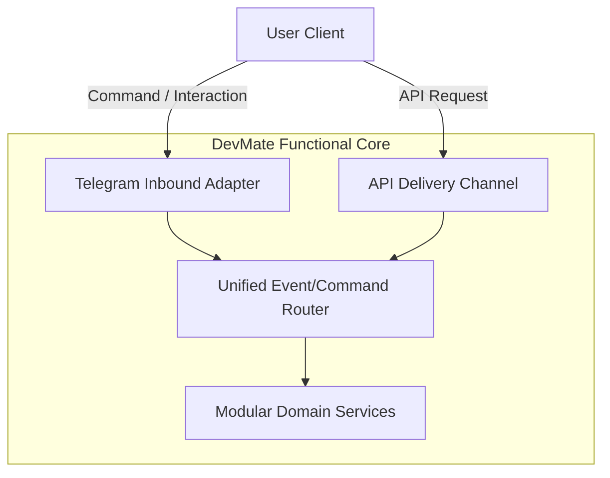
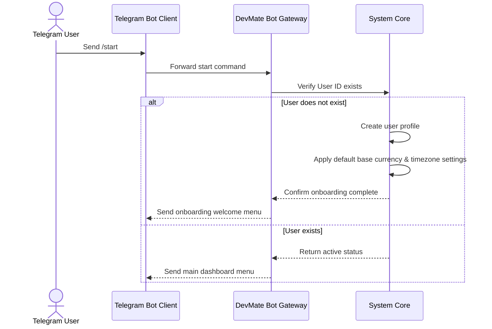
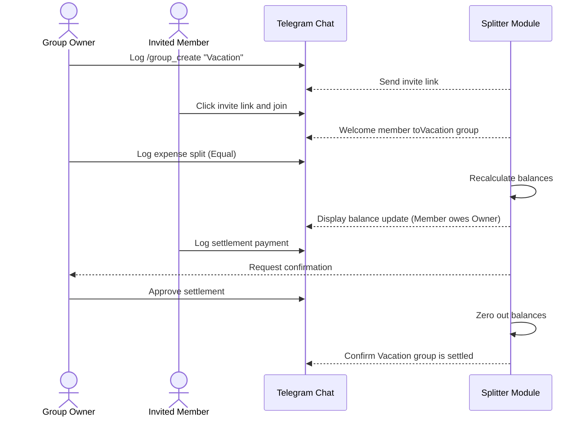
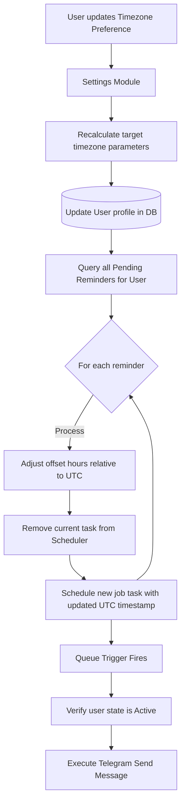
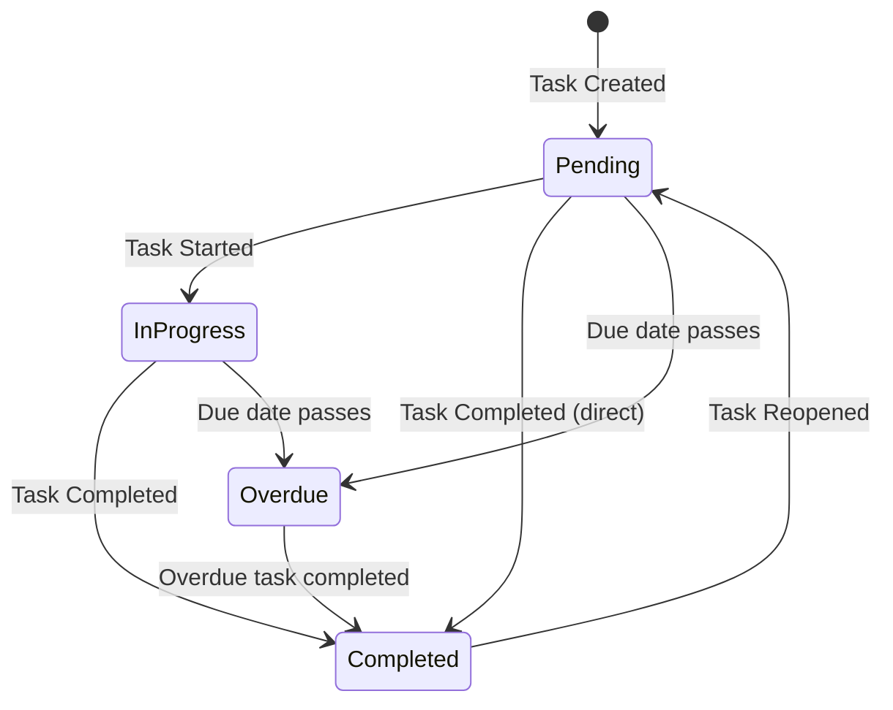
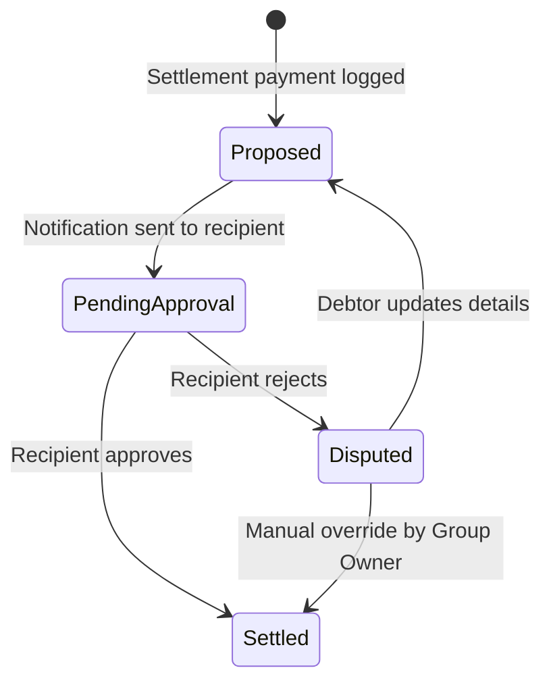
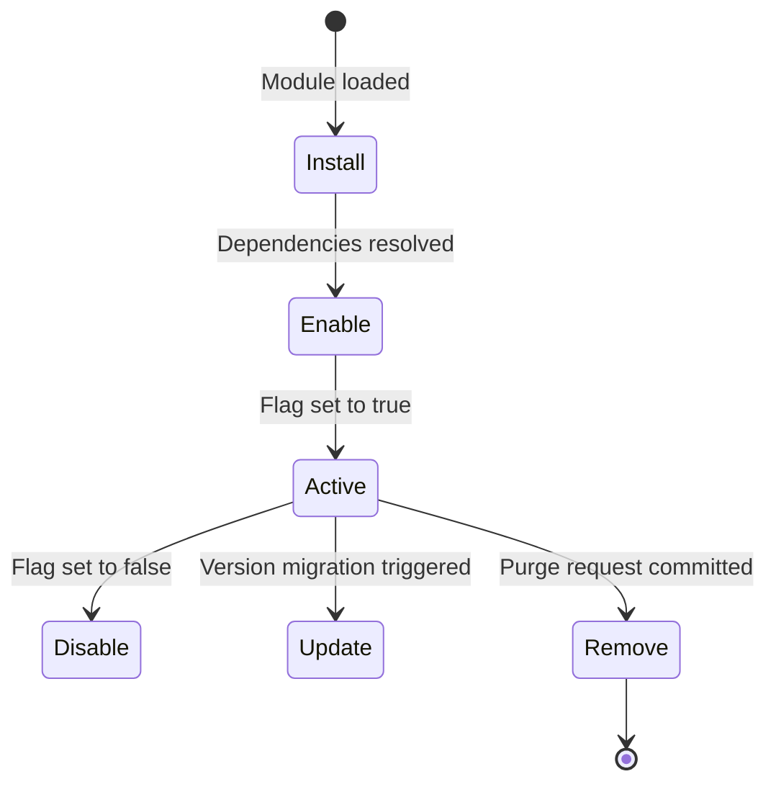

# Functional Specification Document (FSD)
## Project Name: DevMate — The Telegram-based Personal Operating System

---

## 1. Functional Overview

This Functional Specification Document (FSD) outlines the behavioral and functional requirements for the DevMate Personal Operating System. Built upon the approved Product Requirements Document (PRD), this FSD serves as the definitive functional contract for development teams.

DevMate is delivered primarily through a Telegram chatbot, backed by a unified application server. The system is designed using a feature-first, decoupled architecture to ensure all business domains remain delivery-channel agnostic.

---

## 2. Functional Modules

This section describes every functional module in the platform, covering its purpose, responsibilities, inputs, outputs, states, validations, business rules, permissions, flows, edge cases, failure scenarios, error handling, success conditions, dependencies, and future extensions.

### 2.1 Authentication

* **Purpose:** Establish the identity of the user and issue secure session credentials.
* **Responsibilities:** Validate Telegram signatures, verify launch parameters, manage user sessions, and block unauthorized access.
* **Inputs:** 
  - Telegram User ID, First Name, Last Name, Username, Auth Date, and cryptographic signature data.
* **Outputs:** 
  - Authenticated session token or access rejection message.
* **States:** 
  - `Unauthenticated`, `Authenticating`, `Authenticated`, `Expired`.
* **Validations:**
  - Mandatory fields: User ID, Hash, Auth Date.
  - Signature verification checks authenticity against credentials provided by the platform.
  - Auth Date must be within a configured threshold of the current system timestamp to prevent replay attacks.
* **Business Rules:**
  - A user account is automatically provisioned upon the first valid start command received by the bot.
* **Permissions:** Public access for initialization; restricted to owner for active sessions.
* **User Flow:** User starts the bot $\rightarrow$ Client extracts launch parameters $\rightarrow$ Server verifies data $\rightarrow$ System displays home menu.
* **System Flow:** Gateway intercepts request $\rightarrow$ Validates signature $\rightarrow$ Creates session in memory $\rightarrow$ Routes request to target command.
* **Edge Cases:** Telegram Username change. *Resolution:* System maps users via immutable numeric Telegram User ID, auto-updating usernames on incoming commands.
* **Failure Scenarios & Error Handling:** Invalid signature. *Action:* Terminate session, log warning, return auth failure message.
* **Success Conditions:** Data validated, session created, user redirected to requested view.
* **Dependencies:** Telegram Bot API.
* **Future Extensions:** Passkey support.

### 2.2 User Management

* **Purpose:** Administer user profiles, system state, preferences, and platform lifecycles.
* **Responsibilities:** Manage user lifecycle, timezone configuration, base currency preferences, and profile status.
* **Inputs:** Timezone offset, Base Currency code, language preference.
* **Outputs:** Updated user configuration ledger, confirmation status.
* **States:** `Pending Onboarding`, `Active`, `Suspended`, `Deactivated`.
* **Validations:**
  - Timezone must be a valid timezone identifier.
  - Base currency must be a valid currency code.
* **Business Rules:**
  - Suspended users cannot execute commands or receive notifications.
  - Profile deletion triggers a cascade deletion of all non-shared modules and flags shared expense groups as deactivated.
* **Permissions:** Owner only.
* **User Flow:** User inputs settings command $\rightarrow$ Interacts with timezone inline selector $\rightarrow$ Server updates preferences $\rightarrow$ Bot sends confirmation.
* **System Flow:** Controller parses settings action $\rightarrow$ Checks user state $\rightarrow$ Updates Database User Entity $\rightarrow$ Clears user cache $\rightarrow$ Returns success layout.
* **Edge Cases:** User deletes Telegram account. *Resolution:* System automatically deactivates user after consecutive delivery failures.
* **Failure Scenarios & Error Handling:** Database write failure. *Action:* Rollback transaction, notify user.
* **Success Conditions:** User profile updated, configuration cache refreshed.
* **Dependencies:** None.
* **Future Extensions:** Export of complete user data archive in portable format.

### 2.3 Settings

* **Purpose:** Provide a centralized user interface for adjusting user-specific application variables.
* **Responsibilities:** Configure system-wide variables: quiet hours, notifications status, third-party sync keys.
* **Inputs:** Boolean flags (notifications toggle), Quiet hours range (Start/End time).
* **Outputs:** Updated settings state.
* **States:** `Synchronized`, `Dirty` (unsaved changes).
* **Validations:**
  - Quiet hours Start and End must be valid time formats.
* **Business Rules:**
  - Saving settings triggers a refresh of the notification engine queue.
* **Permissions:** Owner only.
* **User Flow:** User navigates to Settings $\rightarrow$ Toggles Daily Summary to Off $\rightarrow$ Saves $\rightarrow$ System confirms.
* **System Flow:** Frontend posts payload $\rightarrow$ Server validates ranges $\rightarrow$ Commits updates $\rightarrow$ Refreshes scheduler.
* **Edge Cases:** Start and End times are identical. *Resolution:* Block input with error message.
* **Failure Scenarios & Error Handling:** Out-of-bounds time range. *Action:* Return validation error.
* **Success Conditions:** Application behavior dynamically updates based on new settings.
* **Dependencies:** User Management.
* **Future Extensions:** Webhook callback endpoints configuration.

### 2.4 Dashboard

* **Purpose:** Render a unified status update showing pending tasks, budget limits, daily streaks, and notifications.
* **Responsibilities:** Consolidate active statuses across PMM, Finance, Habits, and Weather to display in a single layout.
* **Inputs:** User request via dashboard command or client load.
* **Outputs:** Aggregated summary layout.
* **States:** `Loading`, `Ready`, `Stale`.
* **Validations:** None.
* **Business Rules:**
  - Dashboard must highlight overdue tasks and active budget warnings at the top of the view.
  - Personal Vault items are strictly hidden from the Dashboard summary.
* **Permissions:** Owner only.
* **User & System Flow:** User requests dashboard $\rightarrow$ Server queries Todo, Budgets, and Calendar in parallel $\rightarrow$ Assembles components $\rightarrow$ Returns layout message.
* **Edge Cases:** One module query fails during load. *Resolution:* Render the dashboard with a fallback banner for the affected module.
* **Failure Scenarios:** Database timeout. *Action:* Send busy warning message.
* **Success Conditions:** All modules query successfully, rendering a comprehensive dashboard.
* **Dependencies:** PMM, Finance, Weather modules.
* **Future Extensions:** Custom drag-and-drop widgets.

### 2.5 Notes

* **Purpose:** Plain-text and Markdown personal note-taking repository.
* **Responsibilities:** Capture, index, edit, tag, search, and delete personal notes.
* **Inputs:** Note text body, category tags (optional).
* **Outputs:** Saved Note Entity, list of notes matching queries.
* **States:** `Active`, `Archived`, `Deleted`.
* **Validations:**
  - Note content must not be empty.
  - Character limit: Maximum character limits are enforced by the system.
* **Business Rules:**
  - Notes tagged with archive labels are automatically moved to the Archive module.
* **Permissions:** Owner only.
* **User Flow:** User types notes command followed by text $\rightarrow$ Server saves note $\rightarrow$ Bot sends confirmation.
* **System Flow:** Router directs message to Notes Service $\rightarrow$ Parses tags $\rightarrow$ Writes to database $\rightarrow$ Returns confirmation.
* **Edge Cases:** Attempting to edit a note that was deleted. *Resolution:* Return not found error.
* **Failure Scenarios:** Database locking. *Action:* Retry write; if failed, send error to user.
* **Success Conditions:** Note is successfully indexed and searchable.
* **Dependencies:** None.
* **Future Extensions:** Automatic note title generation based on initial lines.

### 2.6 Todo (Tasks)

* **Purpose:** Task list manager supporting deadlines and priorities.
* **Responsibilities:** Manage task lifecycle, parse due dates, and track completion states.
* **Inputs:** Task title, Priority level (Low/Medium/High), Due Date (optional).
* **Outputs:** Task item, status logs.
* **States:** `Pending`, `In-Progress`, `Completed`, `Overdue`.
* **Validations:**
  - Title limit: Strict character boundaries are enforced.
* **Business Rules:**
  - Tasks not completed by their due date are marked as Overdue relative to the user's timezone.
* **Permissions:** Owner only.
* **User Flow:** User inputs task command with deadline text $\rightarrow$ Bot parses deadline $\rightarrow$ Task is saved.
* **System Flow:** Command parser extracts date patterns $\rightarrow$ Task engine saves entry $\rightarrow$ Schedules notification alert before deadline.
* **Edge Cases:** Due date parsed in the past. *Resolution:* Return validation error.
* **Failure Scenarios:** Parsing failure. *Action:* Save task with null due date, prompt user to set one manually.
* **Success Conditions:** Task created, deadline scheduled in the system scheduler.
* **Dependencies:** Notifications Engine.
* **Future Extensions:** Sub-task dependencies trees.

### 2.7 Goals

* **Purpose:** Track multi-step long-term personal and professional objectives.
* **Responsibilities:** Manage goal structures, track milestone completions, and calculate progress ratios.
* **Inputs:** Goal name, Target completion date, milestone list.
* **Outputs:** Goal profile, progress percentage.
* **States:** `Draft`, `Active`, `Achieved`, `Abandoned`.
* **Validations:**
  - Target date must be in the future.
  - At least one milestone is required to activate the goal.
* **Business Rules:**
  - Goal progress is calculated dynamically as the percentage of completed milestones relative to total milestones.
* **Permissions:** Owner only.
* **User Flow:** User creates goal $\rightarrow$ Adds milestones $\rightarrow$ Checks off milestone $\rightarrow$ System updates progress.
* **System Flow:** Goals service updates milestone status $\rightarrow$ Calculates progress ratio $\rightarrow$ Commits new status $\rightarrow$ Sends congratulatory message at 100% completion.
* **Edge Cases:** Deleting all milestones of an active goal. *Resolution:* Set goal progress to 0% and mark status as Draft.
* **Failure Scenarios:** Database transaction timeout. *Action:* Rollback, notify user.
* **Success Conditions:** Goal updated and progress recalculated correctly.
* **Dependencies:** None.
* **Future Extensions:** Visual progress charts.

### 2.8 Calendar

* **Purpose:** Display schedule agendas and manage calendar timelines.
* **Responsibilities:** Fetch, parse, and merge external calendar feeds with internal reminders and due tasks.
* **Inputs:** Calendar feed URL, sync trigger.
* **Outputs:** Consolidated daily or weekly schedule list.
* **States:** `Idle`, `Synchronizing`, `Synced`, `Error`.
* **Validations:**
  - Feed URL must be a well-formed URL.
* **Business Rules:**
  - The system will sync external feeds automatically on a scheduled interval or on-demand via sync command.
  - The calendar module integration is strictly read-only for external feeds.
* **Permissions:** Owner only.
* **User Flow:** User registers feed URL $\rightarrow$ System fetches feed $\rightarrow$ User views agenda.
* **System Flow:** Calendar worker fetches feed $\rightarrow$ Parses calendar data $\rightarrow$ Normalizes event dates to user timezone $\rightarrow$ Persists feed snapshot.
* **Edge Cases:** External calendar server is unreachable. *Resolution:* Keep existing cached schedule, log warning, and flag status as Error.
* **Failure Scenarios:** Timeout parsing large files. *Action:* Enforce maximum size limits on imported feeds.
* **Success Conditions:** Calendar data fully imported and merged with internal database records.
* **Dependencies:** User Management.
* **Future Extensions:** Direct event creation tools.

### 2.9 Reminders

* **Purpose:** Deliver time-sensitive text alerts to users.
* **Responsibilities:** Manage reminder schedules, handle timezone translations, execute notification dispatches, and manage snooze/dismiss/skip flows.
* **Inputs:** Reminder text, Target dispatch time, Recurrence rule, bulk selection list.
* **Outputs:** Scheduled task IDs, notification dispatches.
* **States:** `Pending`, `Fired`, `Missed`, `Snoozed`, `Paused`, `Completed`.
* **Validations:**
  - Target dispatch time must be in the future.
* **Business Rules:**
  - **Snooze/Dismiss/Skip:** Users can snooze an active alert to delay it by a short duration, dismiss it permanently, or skip the current iteration of a recurring rule.
  - **Pause/Resume:** Users can pause a reminder to suspend its triggers, and resume it to reactivate schedule triggers.
  - **Bulk Actions:** Supports bulk pausing, resuming, or deleting of reminders.
  - **Missed Reminder Handling:** Reminders that were scheduled to fire during system downtime are executed immediately upon system restoration and tagged as missed.
  - **Timezone Shifts:** System recalculates trigger times dynamically when a user changes their timezone configuration.
* **Permissions:** Owner only.
* **User Flow:** User sets a recurring reminder $\rightarrow$ Alert fires $\rightarrow$ User clicks inline Snooze button $\rightarrow$ Reminder schedules delay.
* **System Flow:** Scheduler logs trigger $\rightarrow$ On fire time, sends notification $\rightarrow$ Processes user interaction (snooze/dismiss) $\rightarrow$ Updates schedule state.
* **Edge Cases:** Multiple timezone shifts within a short window. *Resolution:* Recalculate schedule queue only on committed timezone settings updates.
* **Failure Scenarios:** Scheduler scheduler loop halt. *Action:* Pull active pending list on boot and rebuild queue.
* **Success Conditions:** Alert sent, user acknowledgement processed.
* **Dependencies:** Notifications Engine.
* **Future Extensions:** Notification delivery to alternative contact routes.

### 2.10 Expense Tracker

* **Purpose:** Record and track personal financial outflows and liabilities.
* **Responsibilities:** Log expenses, catalog transactions, handle multi-currency conversions, manage loans, track EMIs, handle subscriptions, automate recurring entries, and compile analytics.
* **Inputs:** Amount, Currency, Description, Category tag, Loan principal, EMI interest/duration, Subscription cycle.
* **Outputs:** Transaction logs, EMI amortization lists, active subscription panels, financial reports.
* **States:** `Active`, `Settled`.
* **Validations:**
  - Amount must be a positive decimal number greater than 0.
* **Business Rules:**
  - **Subscriptions:** Active services log transactions automatically based on configured billing cycles (e.g., monthly, yearly).
  - **Loans & EMI Tracking:** Loans calculate principal balances. EMI rules generate monthly expense transactions automatically until the loan balance is zero.
  - **Recurring Expenses:** Generates repeating expenses on scheduled intervals.
  - **Analytics:** Provides multi-dimensional spending metrics categorized by tag, source, and timeframe.
* **Permissions:** Owner only.
* **User Flow:** User logs a new loan with EMI parameters $\rightarrow$ System logs initial loan entry $\rightarrow$ Automatically logs monthly EMI payment transactions.
* **System Flow:** Expense engine writes transaction record $\rightarrow$ Resolves currency rate $\rightarrow$ Evaluates recurring/EMI triggers $\rightarrow$ Deducts from active budgets.
* **Edge Cases:** EMI due date lands on non-existent calendar day (e.g., Feb 31). *Resolution:* Roll forward to the last calendar day of the month.
* **Failure Scenarios:** Currency rate feed offline. *Action:* Fallback to last known cached rate with stale warning.
* **Success Conditions:** Transaction saved, budget limits evaluated, analytics dashboards updated.
* **Dependencies:** Currency module, Budgets module.
* **Future Extensions:** Categorization rules utilizing matching tags.

### 2.11 Income Tracker

* **Purpose:** Log and catalog financial inflows.
* **Responsibilities:** Record incoming income, classify sources, automate recurring income, and update reporting metrics.
* **Inputs:** Amount, Currency, Description, Source tag, recurrence cycle.
* **Outputs:** Income transaction entry, recurring logs.
* **States:** `Active`.
* **Validations:**
  - Amount must be greater than 0.
* **Business Rules:**
  - **Recurring Income:** Automates transaction logs for repeating salaries or receivables.
* **Permissions:** Owner only.
* **User & System Flow:** User registers recurring salary $\rightarrow$ Scheduler writes entry to ledger on scheduled dates $\rightarrow$ Refreshes monthly summaries.
* **Edge Cases:** Duplicate income log. *Resolution:* Restrict logs with matching timestamp and amount within a 5-minute window without user confirmation.
* **Failure Scenarios:** Database write block. *Action:* Queue transaction log, notify user.
* **Success Conditions:** Inflow recorded, analytics ledger updated.
* **Dependencies:** Currency module.
* **Future Extensions:** Projection charts based on income trends.

### 2.12 Budgets

* **Purpose:** Establish and enforce spending limits.
* **Responsibilities:** Manage budget thresholds, map expenses, and emit warnings upon boundary violations.
* **Inputs:** Category tag, Monthly limit amount.
* **Outputs:** Budget utilization reports.
* **States:** `Within Limit`, `Warning`, `Exceeded`.
* **Validations:**
  - Limit must be a positive number.
* **Business Rules:**
  - Budgets reset automatically on the first day of every month relative to the user's timezone.
  - Logging an expense triggers a check of budget limits and emits alerts at warning and critical thresholds.
* **Permissions:** Owner only.
* **User & System Flow:** User logs expense $\rightarrow$ Budget service aggregates category spending $\rightarrow$ Emits warning if threshold is violated.
* **Edge Cases:** Budget tag matches multiple expense sub-tags. *Resolution:* Expense matches to the most specific category budget.
* **Failure Scenarios:** Aggregate query failure. *Action:* Skip alert dispatch, log transaction, record diagnostic warning.
* **Success Conditions:** Expense committed and budget status updated.
* **Dependencies:** Expense Tracker.
* **Future Extensions:** Rollover budgets (unspent amounts roll to next month).

### 2.13 Expense Splitter

* **Purpose:** Manage shared financial obligations across multiple users.
* **Responsibilities:** Track group ledgers, manage invites, compute equal/percentage/custom splits, track debt, and optimize payments.
* **Inputs:** Group ID, Payer ID, Amount, Split Type (Equal, Percent, Custom), Participant Roster.
* **Outputs:** Group ledger updates, balance tables, settlement instructions.
* **States:** `Active`, `Archived`.
* **Validations:**
  - Split percentages must sum to exactly 100%.
  - Custom splits must sum to the total expense amount.
* **Business Rules:**
  - **Equal Split:** Amount divided by active participant count. Remainders are added to the payer's share to keep balances flat.
  - **Percentage Split:** Split amounts mapped based on user-defined percentages.
  - **Custom Split:** Specific currency shares mapped per participant.
  - **Debt Tracking & Balance Calculation:** System computes net balances. A net-positive balance means the group owes the user; a net-negative balance means the user owes the group.
  - **Group & Member Lifecycles:** Users cannot leave a group if their balance is non-zero. Owners can archive groups to make them read-only.
* **Permissions:** Members can log and view; Owner can manage group settings.
* **Edge Cases:** Payer changes mid-transaction edit. *Resolution:* Recalculate all group balances from historical log ledger.
* **Failure Scenarios:** Out-of-balance edit. *Action:* Reject entry, restore previous ledger state.
* **Success Conditions:** Split saved, balance ledger updated.
* **Dependencies:** User Management.
* **Future Extensions:** Attachment of receipt images to split records.

### 2.14 Settlement

* **Purpose:** Resolve outstanding debts calculated by the Expense Splitter.
* **Responsibilities:** Record settlement transactions, verify payouts, and adjust balances to zero.
* **Inputs:** Sender ID, Recipient ID, Amount, Payment Method.
* **Outputs:** Settlement logs, balance updates.
* **States:** `Proposed`, `Pending Approval`, `Settled`.
* **Validations:**
  - Amount cannot exceed the absolute value of the debt owed.
* **Business Rules:**
  - Settlement logs require verification from the recipient. Balances do not update until the recipient approves.
* **Permissions:** Group members involved in the transaction.
* **User & System Flow:** Debtor logs settlement payment $\rightarrow$ Creditor receives confirmation prompt $\rightarrow$ Creditor approves $\rightarrow$ Balance ledger zeros out.
* **Edge Cases:** Creditor rejects payment claim. *Resolution:* Flag settlement as Disputed, notify debtor, freeze balance adjustment.
* **Failure Scenarios:** Webhook dispatch failure during verification. *Action:* Keep state as Pending, support retry.
* **Success Conditions:** Ledger balances updated, transaction confirmed.
* **Dependencies:** Expense Splitter.
* **Future Extensions:** Settlement routing via deep link integrations.

### 2.15 Reports

* **Purpose:** Generate financial and activity summaries.
* **Responsibilities:** Aggregates transaction logs, compiles category metrics, and renders text summaries or visual analytics charts.
* **Inputs:** Report Type, Date Range.
* **Outputs:** Markdown charts or image summary panels.
* **States:** `Generating`, `Ready`.
* **Validations:**
  - Start date must be before end date.
* **Business Rules:**
  - Reports are stored temporarily to handle quick navigation requests.
* **Permissions:** Owner only.
* **User & System Flow:** User requests report $\rightarrow$ Server aggregates data $\rightarrow$ Generates report card $\rightarrow$ Delivers card to Telegram.
* **Edge Cases:** Range query returns zero transactions. *Resolution:* Return empty state message.
* **Failure Scenarios:** Image compilation timeout. *Action:* Fallback to text-based table report.
* **Success Conditions:** Report rendered and delivered.
* **Dependencies:** Finance modules.
* **Future Extensions:** Export of monthly PDF financial statements.

### 2.16 File Vault

* **Purpose:** Secure personal document storage.
* **Responsibilities:** Upload, download, rename, categorize, search, sort, flag favorites, list recent files, pin files, track version history, and monitor storage usage.
* **Inputs:** File payload, folder path, tags, version override indicator.
* **Outputs:** Document indicators, file listings, storage usage details.
* **States:** `Active`.
* **Validations:**
  - Supported file extensions and size boundaries are validated.
* **Business Rules:**
  - **Favorites & Pinned Files:** Users can tag files as Favorites or Pin them. Pinned files display at the top of listing views.
  - **Recent Files:** The system keeps a quick-access index of the most recently accessed files.
  - **Version History:** Uploading a file to an identical path creates a new version log, allowing users to restore previous states.
  - **Storage Usage:** Computes aggregate megabytes consumed against user limits.
  - **Duplicate Detection:** Checks file content hashes to prevent duplicate storage.
* **Permissions:** Owner only.
* **User & System Flow:** User uploads document $\rightarrow$ System verifies size $\rightarrow$ Checks for duplicates $\rightarrow$ Registers file in folder tree $\rightarrow$ Updates storage telemetry.
* **Edge Cases:** Moving a folder into its own child folder. *Resolution:* Block move operation with validation error.
* **Failure Scenarios:** Storage limit exceeded. *Action:* Reject file, return upload limit error.
* **Success Conditions:** File registered, version logged, storage usage updated.
* **Dependencies:** Infrastructure storage adapter.
* **Future Extensions:** Folder sharing capabilities.

### 2.17 Secure Notes

* **Purpose:** Encrypted text snippet storage.
* **Responsibilities:** Manage encrypted notes, process search queries on metadata tags, and edit secure payloads.
* **Inputs:** Encrypted text payload.
* **Outputs:** Encrypted note data.
* **States:** `Active`.
* **Validations:**
  - Input cannot be empty.
* **Business Rules:**
  - The system secures data fields flagged as sensitive using server-side encryption at rest.
  - Decryption happens on the server after verifying authorization credentials.
* **Permissions:** Owner only.
* **User Flow:** User opens secure note interface $\rightarrow$ Enters passcode $\rightarrow$ Note decodes $\rightarrow$ User edits text $\rightarrow$ System encrypts and saves.
* **System Flow:** Controller checks authentication state $\rightarrow$ Authorizes session $\rightarrow$ Returns decrypted payload to user view.
* **Edge Cases:** Session expiration mid-edit. *Resolution:* Prompt for authentication override before saving.
* **Failure Scenarios:** Decryption verification failure. *Action:* Block view, log warning.
* **Success Conditions:** Encrypted record committed.
* **Dependencies:** User Management.
* **Future Extensions:** Shareable secure notes with expiry timers.

### 2.18 Password Vault

* **Purpose:** Secure credential management.
* **Responsibilities:** CRUD credentials, auto-generate passwords, and retrieve login pairs.
* **Inputs:** Title, Domain, Username, Password.
* **Outputs:** Credentials profile details.
* **States:** `Active`.
* **Validations:**
  - Username and Title are mandatory fields.
* **Business Rules:**
  - Passwords are encrypted at rest using server-managed encryption keys.
  - Deletion removes credential entry permanently; there is no recycle bin recovery loop for credentials.
* **Permissions:** Owner only.
* **User & System Flow:** User requests passwords list $\rightarrow$ Authenticates $\rightarrow$ Selects item $\rightarrow$ Server decrypts and displays username/password.
* **Edge Cases:** System fails to retrieve key. *Action:* Lock vault, notify user of temporary lookup failure.
* **Success Conditions:** Credentials returned securely.
* **Dependencies:** Secure Notes mechanics.
* **Future Extensions:** Browser extension helper interfaces.

### 2.19 Inventory

* **Purpose:** Physical asset tracking database.
* **Responsibilities:** Log item details, store item locations, track serial numbers, and log warranty expirations.
* **Inputs:** Item Name, Location, Serial Number, Purchase Date, Warranty Expiration Date.
* **Outputs:** Asset record.
* **States:** `In Use`, `In Storage`, `Retired`.
* **Validations:**
  - Expiration date must be after purchase date.
* **Business Rules:**
  - Setting a warranty expiration schedules an automated task reminder before expiry.
* **Permissions:** Owner only.
* **User & System Flow:** User registers item $\rightarrow$ System saves entry $\rightarrow$ Schedules warranty reminder.
* **Edge Cases:** Location is deleted while items remain assigned to it. *Resolution:* Reassign affected items to "Unassigned" default location.
* **Failure Scenarios:** Database write block. *Action:* Reject, notify user.
* **Success Conditions:** Asset logged, reminder scheduled.
* **Dependencies:** Reminders Module.
* **Future Extensions:** Custom item field schemas.

### 2.20 Shopping Lists

* **Purpose:** Quick checklist utility.
* **Responsibilities:** Manage shopping list items, handle updates, and support checklist status.
* **Inputs:** Item name, Quantity.
* **Outputs:** Checklist layouts.
* **States:** `Pending Purchase`, `Purchased`.
* **Validations:**
  - Item name length constraints.
* **Business Rules:**
  - Duplicate item additions increment the item quantity instead of creating a new row.
* **Permissions:** Owner (and shared group members).
* **User Flow:** User logs shopping item $\rightarrow$ Item added $\rightarrow$ User checks button when purchased $\rightarrow$ Checklist updates.
* **System Flow:** Updates status state in ledger $\rightarrow$ Re-renders markdown interface.
* **Edge Cases:** Reopening an archived shopping list. *Resolution:* Restore all unchecked items to active pending status.
* **Failure Scenarios:** Callback interface timeout. *Action:* Send error, reload checklist.
* **Success Conditions:** Checklist state updated.
* **Dependencies:** None.
* **Future Extensions:** Store locations sorting mapping.

### 2.21 Birthday Manager

* **Purpose:** Track birthday records and send notifications.
* **Responsibilities:** Log birthdays, compute age, and dispatch reminders on configured schedule intervals.
* **Inputs:** Contact Name, Birthdate.
* **Outputs:** Birthday logs.
* **States:** `Active`.
* **Validations:**
  - Birthdate must be in the past.
* **Business Rules:**
  - Schedules anniversary reminders automatically on a configured schedule prior to the event date.
* **Permissions:** Owner only.
* **User & System Flow:** User records birthday $\rightarrow$ System registers contact $\rightarrow$ Schedules annual reminder alarms.
* **Edge Cases:** Leap year birthdays. *Resolution:* Fire on March 1st in non-leap years.
* **Failure Scenarios:** Scheduler sync mismatch. *Action:* Sync missing database triggers on boot.
* **Success Conditions:** Birthday logged, triggers scheduled.
* **Dependencies:** Reminders Module.
* **Future Extensions:** Contact import files parsing.

### 2.22 Weather

* **Purpose:** Retrieve local climate data and forecasts.
* **Responsibilities:** Query weather data, format report strings, parse geographic location coordinates.
* **Inputs:** Location string or coordinate pin.
* **Outputs:** Forecast card.
* **States:** `Active`.
* **Validations:**
  - Coordinate range limits are validated.
* **Business Rules:**
  - Forecast results are stored temporarily to prevent duplicate API queries.
* **Permissions:** Owner only.
* **User & System Flow:** User shares location $\rightarrow$ Service queries weather provider $\rightarrow$ Sends forecast metrics.
* **Edge Cases:** Location query returns no matches. *Resolution:* Prompt user for clear city name.
* **Failure Scenarios:** Weather API downtime. *Action:* Return weather offline notice.
* **Success Conditions:** Forecast delivered.
* **Dependencies:** External weather provider.
* **Future Extensions:** Extreme weather warning push alerts.

### 2.23 News

* **Purpose:** Personalized information feed aggregator.
* **Responsibilities:** Fetch RSS feeds, index articles, filter by keywords, and deliver digests.
* **Inputs:** RSS Feed URL, Filter keywords list.
* **Outputs:** Headline list.
* **States:** `Active`.
* **Validations:**
  - RSS Feed URL format check.
* **Business Rules:**
  - Feed fetches are blocked during quiet hours unless overridden by user configurations.
* **Permissions:** Owner only.
* **User & System Flow:** User adds RSS URL $\rightarrow$ System registers feed $\rightarrow$ Parser downloads stream $\rightarrow$ Filters matching keywords $\rightarrow$ Delivers digest.
* **Edge Cases:** Empty feed updates. *Resolution:* Do not notify user if no new articles match.
* **Failure Scenarios:** Target feed timeout. *Action:* Skip, try next feed.
* **Success Conditions:** Articles compiled and delivered.
* **Dependencies:** None.
* **Future Extensions:** Article bookmarking.

### 2.24 Currency

* **Purpose:** Monitor and convert global currency metrics.
* **Responsibilities:** Track exchange rates, execute conversions, and cache rate databases.
* **Inputs:** Source Currency, Target Currency, Amount.
* **Outputs:** Conversion summary.
* **States:** `Rates Updated`, `Rates Stale`.
* **Validations:**
  - Currency codes must exist in the ISO 4217 standard.
* **Business Rules:**
  - Exchange rate tables update automatically on a configured schedule.
* **Permissions:** Owner only.
* **User & System Flow:** User executes conversion command $\rightarrow$ Engine multiplies by target rate $\rightarrow$ Returns converted result.
* **Edge Cases:** Rates update feed is offline. *Resolution:* Use latest stored rates with stale label indicator.
* **Failure Scenarios:** Feed API inaccessible. *Action:* Fallback to stored cache rates.
* **Success Conditions:** Conversion returned.
* **Dependencies:** External rate feeds.
* **Future Extensions:** Currency volatility alerts.

### 2.25 OCR

* **Purpose:** Image text extraction.
* **Responsibilities:** Scan photo uploads, parse receipt fields (vendor, date, amount), and extract business card details (name, email, phone).
* **Inputs:** Image file.
* **Outputs:** Extracted text blocks, parsed entities (metadata fields).
* **States:** `Processing`, `Done`.
* **Validations:**
  - Image size limits are verified.
* **Business Rules:**
  - **Receipt Parsing:** Extracts structured pricing, date, and vendor fields to log expenses directly.
  - **Business Card Parsing:** Extracts contact details to register items directly in the birthday/contact manager.
  - OCR scans execute as a background process.
* **Permissions:** Owner only.
* **User Flow:** User uploads receipt photo $\rightarrow$ System processes OCR $\rightarrow$ Prompts: "Found expense of $20.00 at Vendor. Log it?" $\rightarrow$ User confirms.
* **System Flow:** Receives file $\rightarrow$ Places in background worker queue $\rightarrow$ Runs character scanner $\rightarrow$ Extracts entities $\rightarrow$ Delivers results.
* **Edge Cases:** Blurry image. *Resolution:* Inform user text could not be parsed.
* **Failure Scenarios:** Parser service timeout. *Action:* Alert user, prompt retry.
* **Success Conditions:** Plaintext data and structured entities delivered.
* **Dependencies:** Background job queue, OCR engine.
* **Future Extensions:** Automated parsing of tabular documents.

### 2.26 PDF Utilities

* **Purpose:** PDF document processing tools.
* **Responsibilities:** Merge multiple images/PDFs, split pages, compress files, protect with passwords, unlock encrypted files, and rotate page orientation.
* **Inputs:** PDF file, action parameters (password, page range, rotation angle).
* **Outputs:** Processed PDF document.
* **States:** `Processing`, `Done`.
* **Validations:**
  - File size and page boundaries are validated.
* **Business Rules:**
  - Temporary files created during compilation are erased immediately after delivery.
  - **Protect/Unlock:** Operations happen server-side, encrypting or decrypting documents based on user-supplied passwords.
  - PDF manipulation runs as a background process.
* **Permissions:** Owner only.
* **User Flow:** User sends PDF $\rightarrow$ Selects Split $\rightarrow$ Inputs page range "1-5" $\rightarrow$ System compiles and sends split document.
* **System Flow:** Downloads target document $\rightarrow$ Routes to background worker $\rightarrow$ Executes split task $\rightarrow$ Delivers file $\rightarrow$ Deletes scratch files.
* **Edge Cases:** Target PDF is password-protected. *Resolution:* Prompt user for password before executing split/compress operations.
* **Failure Scenarios:** Disk space limit hit during compilation. *Action:* Cancel, clean workspace, notify user.
* **Success Conditions:** Modified PDF returned.
* **Dependencies:** Background job queue.
* **Future Extensions:** PDF page watermarking.

### 2.27 Habit Tracker

* **Purpose:** Log and monitor behavioral habits.
* **Responsibilities:** Define habits, track daily completions, calculate streaks, and send notifications.
* **Inputs:** Habit Name, Frequency configuration.
* **Outputs:** Streak stats.
* **States:** `Active`, `Paused`.
* **Validations:**
  - Habit name length constraints.
* **Business Rules:**
  - Streak records reset if a habit is not marked complete within the frequency window relative to user local timezone.
* **Permissions:** Owner only.
* **User & System Flow:** User checks off habit $\rightarrow$ System increments streak metrics $\rightarrow$ Checks if daily goals are met.
* **Edge Cases:** Habit frequency changed mid-streak. *Resolution:* Freeze current streak stats, evaluate new parameters starting from next cycle.
* **Failure Scenarios:** Database lock. *Action:* Retry, notify.
* **Success Conditions:** Streak updated and committed.
* **Dependencies:** None.
* **Future Extensions:** Shared habit streaks for travel/splitting groups.

### 2.28 Health Tracker

* **Purpose:** Personal health data log.
* **Responsibilities:** Record step counts, sleep hours, water intake, and weight trends.
* **Inputs:** Category label, Metric value.
* **Outputs:** Daily summary dashboard, trend graphs.
* **States:** `Active`.
* **Validations:**
  - Input metrics must be positive numbers.
* **Business Rules:**
  - Water and Step metrics accumulate daily, resetting at midnight user timezone.
* **Permissions:** Owner only.
* **User & System Flow:** User inputs metric $\rightarrow$ System updates daily logs $\rightarrow$ Outputs remaining target goals.
* **Edge Cases:** Out-of-bounds input values. *Resolution:* Cap values at standard thresholds and request user confirmation.
* **Failure Scenarios:** Transaction timeout. *Action:* Send error, retry.
* **Success Conditions:** Metric logged.
* **Dependencies:** User Management.
* **Future Extensions:** Dynamic hydration goals based on weather temperature.

### 2.29 Reading Tracker

* **Purpose:** Monitor books read and progress.
* **Responsibilities:** Manage reading queues, log progress (page counts), and store book reviews.
* **Inputs:** Title, Author, Total Pages, Current Page, Review.
* **Outputs:** Reading list updates, progress percentages.
* **States:** `To Read`, `Reading`, `Completed`.
* **Validations:**
  - Current page count cannot exceed total page count.
* **Business Rules:**
  - Updating current page count to match total page count auto-transitions book status to Completed.
* **Permissions:** Owner only.
* **User & System Flow:** User logs progress pages $\rightarrow$ System recalculates progress $\rightarrow$ Commits updates.
* **Edge Cases:** Total pages modified after progress logging. *Resolution:* Reject if new total pages is less than current progress page.
* **Failure Scenarios:** Database write block. *Action:* Alert user.
* **Success Conditions:** Reading stats updated.
* **Dependencies:** None.
* **Future Extensions:** Book barcode scans.

### 2.30 Movie Tracker

* **Purpose:** Track media watchlist.
* **Responsibilities:** Manage watchlist queue, record watched status, store ratings.
* **Inputs:** Title, Status (Watchlist/Watched), Rating score.
* **Outputs:** Watchlist index card.
* **States:** `Watchlist`, `Watched`.
* **Validations:**
  - Rating must be within a configured rating scale.
* **Business Rules:**
  - Entries marked as Watched require an associated rating score.
* **Permissions:** Owner only.
* **User & System Flow:** User marks movie as watched $\rightarrow$ Logs rating $\rightarrow$ System saves history card $\rightarrow$ Updates dashboard lists.
* **Edge Cases:** Title duplicate on watchlist. *Resolution:* Alert user: title already logged.
* **Failure Scenarios:** Metadata fetching offline. *Action:* Save text details only, skip graphics, complete save.
* **Success Conditions:** Item added or status modified.
* **Dependencies:** None.
* **Future Extensions:** Dynamic reviews sharing.

### 2.31 Notifications

* **Purpose:** Coordinate user alert dispatches across subsystems.
* **Responsibilities:** Execute message dispatches, enforce timezone schedules, buffer bulk alerts, and process queue states.
* **Inputs:** Notification event payload, recipient ID.
* **Outputs:** Telegram message delivery, dispatch records.
* **States:** `Queued`, `Dispatched`, `Failed`, `Superseded`.
* **Validations:**
  - Notification payload size must not exceed Telegram's API character limits.
* **Business Rules:**
  - **Daily Summary:** Delivered at user-configured briefing time, except during quiet hours (in which case it waits until quiet hours conclude).
  - **Quiet Hours:** Disallow delivery of non-critical messages. Critical alerts bypass quiet hours.
* **Permissions:** System.
* **User Flow:** System schedules daily briefing $\rightarrow$ Briefing fires $\rightarrow$ User reads digest.
* **System Flow:** Scheduler worker evaluates current timezone hours $\rightarrow$ Generates message payload $\rightarrow$ Sends request to Telegram.
* **Edge Cases:** Telegram API rate limits reached. *Resolution:* System queues retry with exponential backoff.
* **Failure Scenarios:** Chat block by user. *Action:* Mark user status as deactivated, drop pending notifications.
* **Success Conditions:** Message successfully parsed and delivered to client.
* **Dependencies:** Distributed worker queue.
* **Future Extensions:** Discord webhook integrations.

### 2.32 Backup & Restore

* **Purpose:** Backup configuration archives and restore states.
* **Responsibilities:** Export complete user database ledger in structured format, process data restores.
* **Inputs:** Archive import file.
* **Outputs:** Encrypted data dump, database restore success metrics.
* **States:** `Idle`, `Backing Up`, `Restoring`.
* **Validations:**
  - Import package must conform to the system database structure version constraints.
* **Business Rules:**
  - Secure Notes and Password Vault entries are exported as encrypted cipher packets. Without the user's Master Password, they remain unreadable.
  - Generating backup cancels any other database operations for the target user.
* **Permissions:** Owner only.
* **User Flow:** User runs backup command $\rightarrow$ Bot exports archive file $\rightarrow$ User downloads. To restore, user uploads archive.
* **System Flow:** System locks user records $\rightarrow$ Generates structure $\rightarrow$ Compiles to file $\rightarrow$ Returns file. On restore: validates file schema $\rightarrow$ Performs database updates $\rightarrow$ Refreshes cache.
* **Edge Cases:** Restoring backup from older database schema version. *Resolution:* Execute system schema migrations on import files to resolve fields before writing database tables.
* **Failure Scenarios:** Schema version mismatch. *Action:* Abort restore, reject file, return "Restore failed: Schema version incompatible."
* **Success Conditions:** Backup generated or system fully restored.
* **Dependencies:** All application database modules.
* **Future Extensions:** Automated weekly backup delivery to secure cloud directories.

### 2.33 Search & Global Search

* **Purpose:** Query records across all active modules.
* **Responsibilities:** Search tasks, notes, vaults, expenses, and log history.
* **Inputs:** Query string, module filters.
* **Outputs:** Matched results checklist.
* **States:** `Active`.
* **Validations:**
  - Query must meet minimum character length boundaries.
* **Business Rules:**
  - **Global Search:** Scans all activated modules simultaneously.
  - Vault contents are omitted from search queries unless the user's secure vault session is active and unlocked.
* **Permissions:** Owner only.
* **User & System Flow:** User inputs search string $\rightarrow$ System matches string against titles, contents, tags $\rightarrow$ Returns structured search list.
* **Edge Cases:** Special characters in search query. *Resolution:* Escape search grammar parameters, parse as plaintext.
* **Failure Scenarios:** Indexing timeouts. *Action:* Fallback to simple title lookup queries.
* **Success Conditions:** Matching records listed.
* **Dependencies:** All modules.
* **Future Extensions:** Advanced boolean search filters.

### 2.34 Tags

* **Purpose:** Centralized labeling system.
* **Responsibilities:** Create, attach, and delete tags across notes, tasks, files, and expenses.
* **Inputs:** Tag name, target record ID.
* **Outputs:** Tag record, tag listings.
* **States:** `Active`.
* **Validations:**
  - Tags must not contain spaces or special character entities.
* **Business Rules:**
  - Tags are globally accessible across all modules (e.g., tagging a note and an expense with `#travel`).
  - Deleting a tag removes the label link from items, not the items themselves.
* **Permissions:** Owner only.
* **User & System Flow:** User adds tag $\rightarrow$ System registers association in cross-reference tables $\rightarrow$ Re-indexes search tables.
* **Edge Cases:** Duplicate tags with different capitalization. *Resolution:* Auto-convert all tags to lowercase.
* **Success Conditions:** Tag attached or removed.
* **Dependencies:** Search module.
* **Future Extensions:** Auto-tagging suggestions.

### 2.35 Archive

* **Purpose:** Store inactive data.
* **Responsibilities:** Move records (notes, tasks, expenses) to a read-only historical repository.
* **Inputs:** Record ID, module source.
* **Outputs:** Archived confirmation.
* **States:** `Archived`.
* **Business Rules:**
  - Archived records are omitted from active lists (e.g., pending tasks, current budgets) but remain searchable.
  - Archive status can be toggled back to Active.
* **Permissions:** Owner only.
* **User Flow:** User archives old project note $\rightarrow$ Note disappears from active notes list $\rightarrow$ Search queries show archived note with "Archived" flag.
* **System Flow:** Updates record status flag to `Archived` $\rightarrow$ Clears cached active list views.
* **Success Conditions:** Record status committed to Archived.
* **Dependencies:** None.
* **Future Extensions:** Automatic archiving based on inactivity filters.

### 2.36 Trash

* **Purpose:** Safeguard against accidental data deletion.
* **Responsibilities:** Store deleted records temporarily, restore items, and execute permanent purges.
* **Inputs:** Record ID.
* **Outputs:** Deletion updates.
* **States:** `In Trash`.
* **Business Rules:**
  - Records moved to Trash are retained for a 30-day window, after which they are permanently deleted.
  - Users can manually empty the Trash to immediately purge files.
* **Permissions:** Owner only.
* **User & System Flow:** User deletes task $\rightarrow$ System flags status as `In Trash` $\rightarrow$ After 30 days, background task permanently erases record.
* **Edge Cases:** Restoring item whose parent folder was permanently deleted. *Resolution:* Restore item to the root directory path.
* **Success Conditions:** Item soft-deleted, recovered, or purged.
* **Dependencies:** Notifications Module (warning before automatic purge).
* **Future Extensions:** Recovery logs.

### 2.37 Notification Center

* **Purpose:** Centralized user notification log.
* **Responsibilities:** Aggregate and display historical notifications, manage read/unread status.
* **Inputs:** Alert event.
* **Outputs:** Notification stream records.
* **States:** `Unread`, `Read`.
* **Business Rules:**
  - Consolidates notifications (reminders, budget warnings, splitter activities) in a single feed.
  - Automatically flags notifications as Read when accessed.
* **Permissions:** Owner only.
* **User Flow:** User opens notifications inbox $\rightarrow$ Reviews budget warnings $\rightarrow$ Marks all as read.
* **System Flow:** Pulls notification logs $\rightarrow$ Filters by status $\rightarrow$ Commits status update on user view.
* **Success Conditions:** Notifications logged and read statuses updated.
* **Dependencies:** Notifications module.
* **Future Extensions:** Custom notification sound channels.

### 2.38 Activity Timeline

* **Purpose:** Log chronological user actions.
* **Responsibilities:** Record system events, track status changes, and present a sequential timeline feed.
* **Inputs:** Module transaction event.
* **Outputs:** Timeline feed lists.
* **States:** `Active`.
* **Business Rules:**
  - Logs critical actions: task completion, expense logged, habit marked, file uploaded.
  - Timeline entries are read-only and cannot be manually modified.
* **Permissions:** Owner only.
* **User & System Flow:** User completes task $\rightarrow$ Task module emits event $\rightarrow$ Timeline service writes log card $\rightarrow$ User views chronological activity feed.
* **Success Conditions:** Log recorded in activity feed database.
* **Dependencies:** All modules.
* **Future Extensions:** Graphical timeline infographics.

### 2.39 User Preferences

* **Purpose:** Manage UI and localization properties.
* **Responsibilities:** Configure base currency, local timezone, default language properties, and display formats.
* **Inputs:** Preference variables.
* **Outputs:** Updated preferences profile.
* **States:** `Active`.
* **Validations:**
  - Base currency must be standard ISO code.
* **Business Rules:**
  - Preference changes apply dynamically to all subsequent interface rendering templates.
* **Permissions:** Owner only.
* **User Flow:** User changes display language to Spanish $\rightarrow$ Bot updates UI translation layers $\rightarrow$ Succeeding menu displays in Spanish.
* **System Flow:** Updates preference record $\rightarrow$ Refreshes session variables $\rightarrow$ Emits translation update.
* **Success Conditions:** Preference saved, UI updated.
* **Dependencies:** User Management.
* **Future Extensions:** Custom theme templates for interactive UI components.

### 2.40 Admin Settings

* **Purpose:** Platform configuration panel.
* **Responsibilities:** Toggle system modules, configure global limit parameters, check subsystem health status.
* **Inputs:** Administrative settings payload.
* **Outputs:** System status flags updates.
* **States:** `Active`.
* **Business Rules:**
  - Restricts configuration privileges strictly to validated admin accounts.
* **Permissions:** Administrator only.
* **User & System Flow:** Admin logs into panel $\rightarrow$ Disables News module $\rightarrow$ System unregisters news command triggers.
* **Success Conditions:** Global parameters updated.
* **Dependencies:** Plugin Lifecycle Engine.
* **Future Extensions:** Automated system status notifications.

### 2.41 Audit Logs

* **Purpose:** Record immutable administrative trails.
* **Responsibilities:** Log administrative events, database changes, imports, and security failures.
* **Inputs:** Administrative events.
* **Outputs:** Read-only log files.
* **States:** `Immutable`.
* **Business Rules:**
  - Audit logs cannot be deleted, cleared, or edited by any user, including administrators.
* **Permissions:** Administrator (Read-Only).
* **System Flow:** Security event triggers $\rightarrow$ Audit logger writes structured file $\rightarrow$ Logs committed.
* **Success Conditions:** Log entry recorded.
* **Dependencies:** None.
* **Future Extensions:** Encrypted compliance exports.

### 2.42 Import

* **Purpose:** Process and map external data archives.
* **Responsibilities:** Parse import files, check schema versions, resolve conflicts, and insert records.
* **Inputs:** Unified data file.
* **Outputs:** Import audit records.
* **States:** `Running`, `Completed`.
* **Validations:**
  - File integrity signature check.
* **Business Rules:**
  - Validates plugin compatibility. If a plugin is disabled, data is stored in inactive state until module is enabled.
* **Permissions:** Owner only.
* **User Flow:** User uploads data backup $\rightarrow$ System validates structure $\rightarrow$ Confirms mapping $\rightarrow$ Restores user environment.
* **System Flow:** Parses archive payload $\rightarrow$ Validates database constraint mappings $\rightarrow$ Resolves conflicts $\rightarrow$ Commits records.
* **Edge Cases:** Import contains duplicate unique records. *Resolution:* Prompt user: overwrite existing records or keep current records.
* **Success Conditions:** Data imported, schema integrity validated.
* **Dependencies:** All modules.
* **Future Extensions:** Selective module import.

### 2.43 Export

* **Purpose:** Create portable data archives.
* **Responsibilities:** Fetch user records, compile data streams, generate download links.
* **Inputs:** Export command trigger.
* **Outputs:** Downloadable data package.
* **States:** `Running`, `Completed`.
* **Business Rules:**
  - Security fields and vault items are exported only in their encrypted states.
* **Permissions:** Owner only.
* **User & System Flow:** User triggers export $\rightarrow$ System compiles modules into archive format $\rightarrow$ Sends file link to user.
* **Success Conditions:** Archive compiled, temporary download link generated.
* **Dependencies:** All modules.
* **Future Extensions:** Automated scheduled export schedules.

---

## 3. Business Rules

### 3.1 Financial Calculations
* **Multi-Currency Rounding:** Calculations are maintained to high precision levels, with final balances rounded to currency-specific decimal structures (e.g., 2 decimal points for USD, 0 for JPY). Any division remainder fractions are added to the payer's share to keep group balances flat.
* **EMIs & Loans:** Amortization rates and interest values must log sequential transactions matching configured periods.
* **Budget Reset:** Budgets evaluate spending relative to target category tags, resetting automatically on the first day of the month.

### 3.2 Timezone & Scheduler Rules
* Scheduler calculates target dates relative to the user's localized timezone, saving dates in UTC.
* Missed reminders due to system downtime fire immediately upon restoration, marked with a missed alert tag.

### 3.3 Security & Encryption Rules
* Sensitive data fields (Vault items, passwords) are encrypted before database entry using symmetric encryption.
* Encryption keys are managed securely by the server environment, decoupled from the main database tables.

---

## 4. Validation Rules

This table specifies functional validation constraints enforced across modules.

| Module | Entity | Field | Requirement | Type / Constraint | Failure Action |
| :--- | :--- | :--- | :--- | :--- | :--- |
| **Auth** | Session | Launch Parameters | Required | Format check | Reject session |
| **Tasks** | Todo | Title | Required | Length check | Return validation error |
| | | Due Date | Optional | Future date check | Set to null; save |
| **Splitter**| Group | Name | Required | Length check | Reject creation |
| | Expense | Amount | Required | Positive value (> 0.00) | Return validation error |
| | | Split Roster | Required | Non-empty array | Reject transaction |
| **Vault** | File | Extension | Required | Block list check (no scripts) | Reject upload; log event |
| | | Size | Required | Max boundary limit | Reject file; return error |
| **Reminder**| Trigger | Time | Required | Future date check | Reject scheduling |
| **Search** | Query | Keyword | Required | Min length check | Ignore query |

---

## 5. User Flows

### 5.1 Onboarding and Account Creation

### 5.2 Expense Splitting Group Flow

---

## 6. System Flows

### 6.1 Reminder Scheduling and Timezone Translation System

---

## 7. State Transitions

### 7.1 Todo Task State Transitions

### 7.2 Expense Splitter Settlement State Transitions

---

## 8. Permissions

DevMate enforces strict Role-Based Access Control (RBAC).

| Module | Role: Administrator | Role: Verified Owner | Role: Public / Guest |
| :--- | :--- | :--- | :--- |
| **Authentication** | Full Access | Full Access | Provision only |
| **User Profile** | Full Access | Modify own settings | Denied |
| **Personal Vault** | Denied | Full Access | Denied |
| **Todo / Notes** | Denied | Full Access | Denied |
| **Expense Splitter** | Manage metadata | Log splits / settle | Denied |
| **Reminders** | Denied | Full Access | Denied |
| **Admin Settings** | Full Access | Denied | Denied |
| **Audit Logs** | Read-Only | Denied | Denied |

---

## 9. Notifications Specifications

This table outlines system-generated notifications and suppression conditions.

| Event ID | Name | Target Recipient | Trigger Event | Suppression / Quiet Hours Rules |
| :--- | :--- | :--- | :--- | :--- |
| **NOT-001** | Daily Briefing | Account Owner | Configuration briefing time reaches. | Suppressed in Quiet Mode. |
| **NOT-002** | Task Deadline | Account Owner | Configured duration before task due date. | Critical alert. Bypasses quiet hours. |
| **NOT-003** | Birthday Alert | Account Owner | Birthday schedule reaches. | Subject to quiet hours. |
| **NOT-004** | Expense Log Alert | Group Members | Expense logged in group chat. | Dispatched immediately. |
| **NOT-005** | Budget Warning | Account Owner | Spending reaches warning threshold. | Dispatched immediately. |
| **NOT-006** | Vault Access Alert | Account Owner | Vault session initialized. | Critical alert. Bypasses quiet hours. |

---

## 10. Error Handling Specifications

### 10.1 Error Classifications
* **Recoverable Errors:** System failures resolved by retrying, correcting inputs, or waiting for third-party endpoints.
* **Fatal Errors:** Failures that compromise security, violate database structures, or result in corrupt data streams. These abort the active process immediately.

### 10.2 Error Matrix and Logging Rules

| Error Code | Class | User-Facing Message | Logging Payload | Remediation |
| :--- | :--- | :--- | :--- | :--- |
| **ERR-AUTH-101** | Fatal | "Security Check Failed. Session terminated." | Auth verification failed for ID. | Terminate request, clear session cache. |
| **ERR-FILE-204** | Recoverable | "Upload Failed: Supported extensions are pdf, png, jpg." | File blocked due to invalid extension. | Reject file. |
| **ERR-LIMIT-302** | Recoverable | "Action blocked: Daily rate limits reached." | Rate limit hit for User. | Implement cool-down. |
| **ERR-DB-500** | Fatal | "System database is busy. Your input was not saved." | Database Write Failure. | Rollback transactions. |
| **ERR-VAULT-401** | Recoverable | "Decryption error: Password invalid." | Decryption verification failed. | Alert user, block view. |

---

## 11. Module Interactions

This section describes how modules communicate functionally.

### 11.1 Expense Flow

* **Behavior:** Logging an expense updates the respective category budget. The changed budget metrics are indexed by the Reports module. The reports update the Dashboard summary cards, and if budget thresholds are exceeded, the Notifications module dispatches an alert.

### 11.2 Reminder Flow

* **Behavior:** A reminder trigger fires, prompting the Notifications module to dispatch a text alert. Concurrently, the upcoming schedule updates the Dashboard agenda widget.

### 11.3 Birthday Flow

* **Behavior:** A birthday milestone triggers a reminder in the Reminders module, which registers schedule events and flags the anniversary on the Dashboard dashboard overview.

---

## 12. Plugin Functional Lifecycle

Every feature in DevMate behaves functionally as an independent plugin.

* **Install:** The system registers the module in the global list of capabilities, verifying integrity and configuration metadata.
* **Enable:** The plugin's functional features (bot command registers, alert timers, event listeners) are activated.
* **Disable:** Command triggers and notifications are suspended. The plugin becomes inactive, but its data remains.
* **Update:** Migrations are run on database structures to update functionality to new version specs without losing user data.
* **Remove:** Completely detaches the module, purging associated configurations and database records.
* **Dependencies:** During installation, modules declare dependent modules. The system prevents activation if a required plugin is disabled or missing.
* **Shared Capabilities:** Modules publish events to a shared event bus (e.g., `TransactionLogged`) and read metrics from core shared contracts.
* **Module Isolation:** A plugin’s internal data structures cannot be joined or modified directly by another plugin. Cross-module data queries are routed strictly through functional interfaces.
* **Future Extensibility:** Command namespaces are allocated dynamically, allowing developers to inject new commands without modifying the core routing logic.

---

## 13. Edge Cases

### 13.1 Double-Split Race Conditions
* **Behavior:** If two users update a split ledger simultaneously, database writes are queued, and calculations are executed sequentially to prevent incorrect balance updates.

### 13.2 Timezone Shift Overlaps
* **Behavior:** If a user shifts timezone and a reminder is rescheduled into the past, the trigger is skipped for that day and rescheduled for the next day's matching hour.

### 13.3 Incomplete Uploads
* **Behavior:** If an upload drops connection, incomplete files are immediately deleted, and the user is prompted to retry.

---

## 14. Assumptions

- **Telegram API Stability:** Telegram webhook dispatches remain functional and deliver message packets within standard times.
- **Clock Sync:** The application server keeps system time synchronized with standard time metrics.

---

## 15. Constraints

- **Telegram Message Size:** Plain-text message payloads sent through the Telegram Bot API cannot exceed standard limits. Large summaries must be sent as files or split.
- **Telegram Rate Limits:** Dispatches must be queued and throttled to prevent rate violations on Telegram chats.

---

## 16. Future Enhancements

- **Direct Voice Parsing:** Translate voice notes directly into todo/expense inputs using audio-to-text parsers.
- **Shared Calendar Sync:** Share calendar agendas across split group members.
