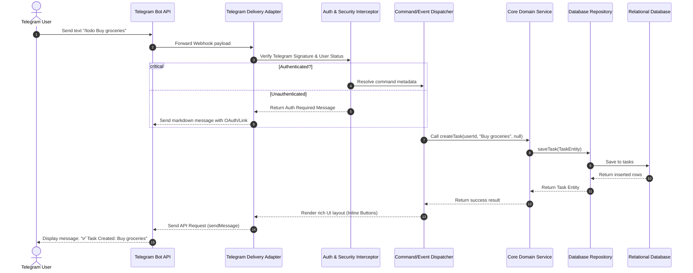
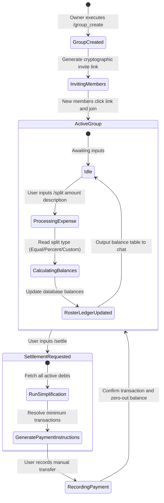
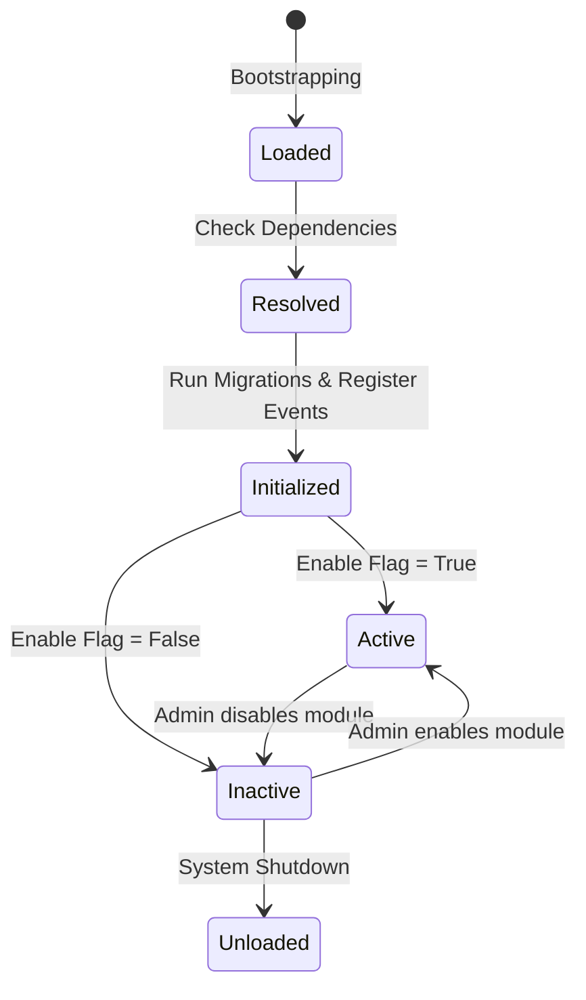
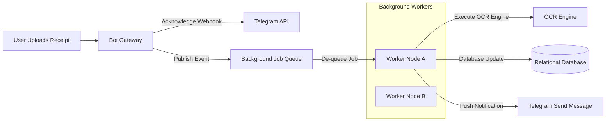

# Product Requirements Document (PRD)
## Project Name: DevMate — The Telegram-based Personal Operating System

---

## 1. Vision

**DevMate** is a unified **Personal Operating System (POS)** that leverages Telegram as its primary, low-friction command interface. The platform is designed to consolidate a user's digital life—encompassing daily productivity, private finance, document utility, secure credentials, and collaborative expense splitting—into a single, secure, and responsive interface.

DevMate is designed to be **Telegram-first**. Telegram serves as the primary and initial delivery channel for all user interactions. The architecture decouples the core business logic from the communication channel, ensuring that while the platform launches and operates exclusively on Telegram in V1, the entire system can support future client interfaces (such as Web Dashboards, Telegram Mini Apps, or mobile applications) as future expansions without refactoring core domain services.

---

## 2. Goals

- **Unified Telegram Center:** Consolidate notes, tasks, finances, vaults, and utilities into one cohesive system accessible via Telegram text commands and interactive buttons.
- **Secure Encrypted Storage:** Provide enterprise-grade server-side encryption for passwords, secure notes, and personal files, ensuring that sensitive data is stored securely at rest and in transit.
- **Robust Collaboration:** Establish a friction-free, invite-based expense splitting module within Telegram to track, calculate, and settle balances in group settings without external apps.
- **High-Velocity Extensibility:** Design a highly modular, feature-first monorepo that supports numerous modules and database tables, allowing multiple developers to build features independently.
- **Clean Architecture & Decoupling:** Enforce strict architectural boundaries that completely separate presentation adapters (Telegram) from domain services and database repositories.

---

## 3. Non-Goals

- **Public Social Networking:** DevMate is designed for personal organization and private, finite group collaboration (such as family or travel expense splitting). It will not support public forums, global channels, or discoverable search directories.
- **Proprietary Cryptography:** The platform will not implement custom cryptographic algorithms. It must use industry-standard, battle-tested cryptographic libraries and protocols for all encryption and transport security.
- **Automated Financial Transactions:** The system tracks budgets, expenses, and settlements manually or via read-only statement parses. It will not execute direct bank transfers, wire funds, or integrate write-access payment gateways for user accounts.
- **Continuous Media Streaming:** While DevMate stores personal documents and files, it is not a media streaming platform. Video/audio streaming or high-volume hosting of media files is out of scope.

---

## 4. Personas

### Persona A: Alex, the Busy Developer & Tech Professional
* **Bio:** Alex is a Senior Software Engineer who spends 10+ hours a day in terminal environments and messaging apps. They prefer keyboard-driven flows and dislike switching between heavy web applications for tasks, quick notes, or logging expenses.
* **Pain Points:** 
  - Fragmentation of data across Notion (notes), Todoist (tasks), and Splitwise (shared expenses).
  - Privacy concerns regarding personal data stored on commercial cloud planners.
  - Lack of rapid capture mechanism when away from a laptop.
* **How DevMate Helps:** Alex can type `/todo buy milk` or `/expense 15 lunch` directly into Telegram. They use the secure vault for server SSH keys using secure server-side encrypted storage.

### Persona B: Sarah, the Independent Freelancer
* **Bio:** Sarah runs a boutique design consultancy and manages multiple client projects. She is constantly on the move and relies heavily on mobile notifications and quick document scanner utilities.
* **Pain Points:**
  - Manually tracking business mileage, receipts, and conversion rates across international clients.
  - Forgetting client birthdays and follow-up reminders.
  - Juggling multiple tools while traveling.
* **How DevMate Helps:** Sarah uses the OCR utility to scan physical receipts, logs income in multiple currencies with auto-conversion, and receives a consolidated daily briefing containing her schedule, client birthdays, and weather forecasts.

### Persona C: The Apartment Housemates (Collaborative Group)
* **Bio:** A group of three roommates (Emma, Liam, and Raj) sharing rent, utilities, and grocery bills.
* **Pain Points:**
  - Tracking who bought toilet paper, who paid the Wi-Fi bill, and calculating complex splits at the end of the month.
  - Downloading and registering on separate apps just to split a dinner bill.
* **How DevMate Helps:** They create a DevMate expense group inside their shared Telegram chat. Emma inputs `/split 60 groceries @Liam @Raj`, and the system automatically calculates the debt, handles custom percentages, and provides a clear settlement path.

---

## 5. Functional Requirements

### 5.1 Personal Management Module (PMM)

| ID | Feature | Description | Priority |
| :--- | :--- | :--- | :--- |
| **FR-PM-001** | Notes Capture | Create, read, update, and delete (CRUD) plain text and rich markdown notes via text commands or interactive buttons. | P1 |
| **FR-PM-002** | Todo & Tasks | Manage tasks with priorities (Low, Medium, High), statuses (Pending, In-Progress, Completed), and optional due dates. | P1 |
| **FR-PM-003** | Goals Tracker | Set long-term objectives with measurable sub-tasks, progress bars (calculated dynamically), and target completion dates. | P2 |
| **FR-PM-004** | Internal Calendar | The platform manages its own internal calendar. Display daily schedules and agendas via the Telegram interface. | P2 |
| **FR-PM-005** | Reminders Engine | Set one-time or recurring reminders (e.g., "every Tuesday at 9 AM") with timezone-aware parsing. Supports snooze, dismiss, skip, repeat, complex recurring rules, and missed reminder handling. | P1 |
| **FR-PM-006** | Shopping Lists | Shared or individual checklist notes optimized for rapid checking/unchecking with inline buttons. | P2 |
| **FR-PM-007** | Birthday Manager | Store contacts' birthdays and auto-schedule notification alerts 1 week and 1 day prior, plus day-of. | P2 |

### 5.2 Finance Module (FM)

| ID | Feature | Description | Priority |
| :--- | :--- | :--- | :--- |
| **FR-FIN-001** | Expense Tracker | Log expenses with category tags (e.g., Food, Rent, Travel), amount, and description via quick syntax (`/exp 12.50 coffee`). Expanded with recurring expenses, subscriptions, loans, EMI tracking, categories, reports, and analytics. | P1 |
| **FR-FIN-002** | Income Tracker | Track incoming funds against custom categories (e.g., Salary, Freelance, Investments). Expanded with recurring income. | P1 |
| **FR-FIN-003** | Budget Tracking | Establish monthly limits per category and receive warnings when spending reaches warning and critical thresholds. | P1 |
| **FR-FIN-004** | Financial Reports | Generate text summaries and visual analytics charts rendered as images directly in the chat. | P2 |
| **FR-FIN-005** | Currency Converter | Automatically convert foreign currency logs using daily updated exchange rates against the user's base currency. | P2 |

### 5.3 Expense Splitter Module (ESM)

| ID | Feature | Description | Priority |
| :--- | :--- | :--- | :--- |
| **FR-SPL-001** | Group Invites | Generate secure, time-bound join links for Telegram users to join an expense sharing group. | P1 |
| **FR-SPL-002** | Group Roster | Maintain a ledger of active members, allowing nicknames and linking to unique Telegram IDs. | P1 |
| **FR-SPL-003** | Equal Splitting | Distribute an expense evenly among all members of the group by default. | P1 |
| **FR-SPL-004** | Percentage Split | Distribute an expense where members owe predefined percentages totaling exactly 100%. | P2 |
| **FR-SPL-005** | Custom Split | Manually allocate specific decimal amounts to each member for a single transaction. | P2 |
| **FR-SPL-006** | Debt Settlement | Calculate the absolute minimum number of payments required to settle all debts (Simplifying Debts algorithm). | P1 |
| **FR-SPL-007** | Payment Ledger | Record manual payment transactions (e.g., "Alex paid Emma $20 via bank transfer") to resolve outstanding balances. | P1 |
| **FR-SPL-008** | Group Balance | Query current ledger balances showing who owes whom and the aggregate net balance for each user. | P1 |

### 5.4 Personal Vault Module (PVM)

| ID | Feature | Description | Priority |
| :--- | :--- | :--- | :--- |
| **FR-VLT-001** | Secure Notes | Store sensitive text snippets (e.g., recovery keys, addresses) in secure encrypted server storage. | P1 |
| **FR-VLT-002** | File Vault | Securely encrypt and store files (documents, images, credentials). Expanded with nested folders, tags, rename/move, search/sorting, duplicate detection, and storage limits. | P1 |
| **FR-VLT-003** | Password Vault | Store passwords, usernames, and URLs. Support categories, searching, and auto-generation of secure passwords. | P1 |
| **FR-VLT-004** | Asset Inventory | Track high-value personal assets, physical locations, serial numbers, and warranty documents (with renewal notifications). | P2 |

### 5.5 Utilities Module (UM)

| ID | Feature | Description | Priority |
| :--- | :--- | :--- | :--- |
| **FR-UTL-001** | Weather Service | Fetch current weather and 3-day forecasts based on manual location pin or shared GPS coordinates. | P2 |
| **FR-UTL-002** | News Aggregator | Parse RSS feeds or fetch top headlines categorized by interests (Tech, Finance, Science) using filter keywords. | P2 |
| **FR-UTL-003** | OCR Reader | Accept images of documents or receipts, perform optical character recognition, and return parsed receipt data. | P1 |
| **FR-UTL-004** | PDF Compiler | Merge multiple images into a single PDF, extract text from PDFs, or compress PDF files. | P2 |

### 5.6 Lifestyle Module (LM)

| ID | Feature | Description | Priority |
| :--- | :--- | :--- | :--- |
| **FR-LFS-001** | Habit Tracker | Define daily/weekly habits. Mark habits as complete via interactive daily buttons. Log streak counts. | P2 |
| **FR-LFS-002** | Health Tracker | Log basic health metrics: daily steps, sleep hours, water intake, and weight trends. | P2 |
| **FR-LFS-003** | Reading Log | Track books read, page progress, ratings, and write short personal reviews. | P3 |
| **FR-LFS-004** | Movie/Show Watchlist | Keep a list of movies/shows to watch, integrated with external APIs to pull posters and descriptions. | P3 |

### 5.7 Notifications Engine (NE)

| ID | Feature | Description | Priority |
| :--- | :--- | :--- | :--- |
| **FR-NTF-001** | Scheduled Dispatch | Deliver reminder messages precisely at the user's localized target time (supporting dynamic timezones). | P1 |
| **FR-NTF-002** | Daily Briefing | A single, customizable morning digest outlining tasks due today, upcoming birthdays, weather, and budget status. | P1 |
| **FR-NTF-003** | Quiet Hours | Allow users to define periods during which non-urgent notifications are queued and delayed. | P2 |

### 5.8 Core & System Management Modules (New)

| ID | Feature | Description | Priority |
| :--- | :--- | :--- | :--- |
| **FR-SYS-001** | Settings | Configure user preferences, timezone profiles, security preferences, and active notifications. | P1 |
| **FR-SYS-002** | User Preferences | Store bot language properties, base currency definitions, and display metrics. | P1 |
| **FR-SYS-003** | Dashboard | Unified home panel showing active tasks, budget alerts, daily goals, and upcoming events. | P1 |
| **FR-SYS-004** | Global Search | Multi-module search engine matching keywords across notes, tasks, expenses, and vaults. | P2 |
| **FR-SYS-005** | Tags | A unified labeling engine to tag and query elements across notes, tasks, and files. | P2 |
| **FR-SYS-006** | Archive & Trash | Archive inactive items or temporarily soft-delete records into a Trash bin with automatic purge logic. | P2 |
| **FR-SYS-007** | Backup & Restore | Import and export the complete system state and user data using structured portable archive files. | P1 |
| **FR-SYS-008** | Activity Timeline | A chronological feed tracking transactions, task completions, and status logs. | P2 |
| **FR-SYS-009** | Notification Center | Central inbox routing critical alerts, warning dispatches, and system messages. | P1 |
| **FR-SYS-010** | Admin & Audit Logs | Administrative panels for module status controls and immutable audit trails of operations. | P1 |

---

## 6. Non-Functional Requirements

### 6.1 Scalability
- **Capacity:** The system must comfortably scale to handle large active user bases and process high daily message volumes without degraded performance.
- **Data Model Complexity:** The database design must scale to support complex modular structures with clean query performance. Appropriate indexing, partitioning, and read-replica strategies must be utilized.
- **Asynchronous Execution:** Heavy operations (OCR, PDF compilation, image generation) must run off-thread via a background job queue.

### 6.2 Maintainability & Developer Experience (DX)
- **Monorepo Architecture:** The codebase must reside in a single repository with shared linting, formatting, and build tools, using modular directory boundaries to isolate domain logic.
- **Strict Linting & Constraints:** Build pipelines must automatically fail if a file exceeds the line limits or if circular imports are detected.
- **Consistent Code Structure:** Every feature module must follow the exact same architectural pattern (Feature-First Architecture) so developers can transition between modules instantly.

### 6.3 Performance & Reliability
- **Response Latency:** Latency for standard bot text commands must remain rapid under normal operating loads (excluding heavy OCR or file generation tasks).
- **Webhook Processing:** Telegram webhook requests must be acknowledged within standard timeouts to prevent Telegram from retrying the request. All processing must happen asynchronously after acknowledgement.
- **Uptime:** The system must achieve production-ready availability with minimal maintenance downtime.

### 6.4 Extensibility
- **Omni-channel Ready:** The business logic must be agnostic to Telegram. Standardized interfaces must enable developers to build alternative controllers or add delivery adapters as future expansions with zero changes to domain service code.
- **Plugin Architecture:** The system must support a modular plugin architecture to easily load or unload distinct domains.

### 6.5 Testability
- **Coverage:** High unit and integration test coverage must be maintained overall, targeting core business logic services.
- **Isolated Testing:** Every module must be testable in complete isolation, replacing external database and infrastructure layers with mock interfaces.

---

## 7. User Stories

### Story 1: Daily Quick Tasks (Productivity)
> **As a** busy professional,  
> **I want to** quickly type a short command to add a task with a due date directly into Telegram,  
> **So that** I don't disrupt my workflow or lose track of my commitments.

### Story 2: Shared Dinner Bill (Expense Splitter)
> **As a** member of a travel group,  
> **I want to** log a restaurant bill split customly (e.g., Alice paid, Bob owes 40%, Charlie owes 30%, Alice owes 30%),  
> **So that** the shared ledger accurately records outstanding balances without manual arithmetic errors.

### Story 3: Vault Security (Security)
> **As a** security-conscious individual,  
> **I want to** store a database password in the Vault,  
> **So that** my credentials remain secure under standard encrypted storage guidelines.

### Story 4: Automated Morning Summary (Engagement)
> **As an** organized user,  
> **I want to** receive a single summary message every morning at my scheduled briefing time containing my calendar and weather summary,  
> **So that** I can plan my day effectively without opening multiple apps.

### Story 5: Receipt Processing (Utility)
> **As a** business traveler,  
> **I want to** snap a photo of my taxi receipt and upload it to the bot,  
> **So that** the system extracts the vendor name, date, and final currency amount automatically using OCR and saves it directly to my expense tracker.

---

## 8. Acceptance Criteria

### AC-1: Task Creation and Date Parsing
* **Scenario: Create a task with standard shorthand syntax**
  * **Given** the user is authenticated and is in the direct message chat with DevMate.
  * **When** the user sends the command `/todo Submit project proposal by Friday at 5 PM`.
  * **Then** the system parses the task description as "Submit project proposal".
  * **And** sets the due date to the upcoming Friday at 17:00:00 relative to the user's configured timezone.
  * **And** responds with a success confirmation message showing the task details and an inline "Complete" button.

### AC-2: Group Settlement Calculation
* **Scenario: Calculate simplified debt settlements in a group**
  * **Given** a group ledger has three active members: Alice, Bob, and Charlie.
  * **And** Alice owes Bob $10, and Bob owes Charlie $10.
  * **When** the user executes the `/settle` command inside the group chat.
  * **Then** the system calculates the simplified transaction path: "Alice owes Charlie $10".
  * **And** outputs a structured markdown table showing the net balances and the optimized settlement transactions.

### AC-3: Secure Password Retrieve
* **Scenario: Safely store and decrypt vault credential**
  * **Given** a user is accessing the password vault.
  * **When** the user attempts to view credentials for "Server SSH Key".
  * **Then** the system verifies authorization credentials.
  * **And** decrypts the payload from the secure server-side encrypted storage.
  * **And** displays the secret to the user securely.

### AC-4: Expense Splitting Group Creation
* **Scenario: Invite member to expense splitter group**
  * **Given** a user has initialized a new group named "Roadtrip 2026" via the `/group_create Roadtrip 2026` command.
  * **When** the user clicks "Generate Invite Link".
  * **Then** the system creates a cryptographic, single-use token embedded in a Telegram URL (e.g., `t.me/DevMateBot?start=join_g_XYZ123`).
  * **And** sets the link to expire in 48 hours.
  * **And** once a second user opens the link, they are automatically added to the group roster and welcomed in the ledger.

---

## 9. Product Flows

### 9.1 Commands & Interactive UI Flow (Telegram Bot)

The following diagram illustrates how user messages are routed between the Telegram interface, the decoupled bot router, and the domain logic.



### 9.2 Expense Splitter Product Flow

How transactions flow from logging to final settlement calculation inside a group context:



---

## 10. System Overview

### 10.1 High-Level Architecture Principles

DevMate uses a decoupled, clean architecture to ensure the core business logic remains independent of communication clients and specific database models.

```mermaid
graph TD
    %% Clients Layer
    subgraph Delivery Layer (Clients & Adapters)
        TG_Bot[Telegram Bot Interface]
        Future_App[Future TMA / Web / Mobile Expansion]
    end

    %% API / Gateway Layer
    subgraph Access & Routing Layer (Adapters)
        TG_Webhook_Handler[Telegram Webhook Controller]
        API_Gateway[API Layer Gateway / Controllers]
    end

    %% Application Layer
    subgraph Core Application Layer (Ports)
        App_Services[Application Services / Command Handlers]
        Auth_Service[Authentication & Session Manager]
        Worker_Queue[Background Job Queue]
    end

    %% Domain Layer
    subgraph Pure Domain Layer (Business Rules)
        Domain_Models[Domain Models / Entities]
        Domain_Services[Domain Business Logic Services]
    end

    %% Infrastructure Layer
    subgraph Infrastructure & Data Layer (Adapters)
        Repo_Impl[Repository Implementations]
        Relational_DB[(Relational Database)]
        Cache_DB[(Distributed Cache)]
        Vault_Storage[Object Storage]
        OCR_Engine[OCR Engine]
    end

    %% Relationships
    TG_Bot -->|Webhooks| TG_Webhook_Handler
    Future_App -->|API Requests| API_Gateway

    TG_Webhook_Handler --> App_Services
    API_Gateway --> App_Services

    App_Services --> Domain_Services
    Domain_Services --> Domain_Models

    Domain_Services -->|Use Interfaces| Repo_Impl
    Repo_Impl --> Relational_DB
    Repo_Impl --> Cache_DB
    Repo_Impl --> Vault_Storage
    
    App_Services --> Worker_Queue
    Worker_Queue --> OCR_Engine
```

---

## 11. Module Breakdown & Architectural Principles

### 11.1 Monorepo Structure & Decoupling Principles
To enforce the non-functional requirements of modularity and maintainability, the system is developed within a Monorepo. No module is permitted to import code directly from another module's internal directories. All shared code must reside inside designated shared packages.

### 11.2 Feature Module Boundaries
Every feature module must implement a strict architectural boundary:
1. **Core Domain Layer:** Pure business rules, entities, and exception models.
2. **Application Layer:** Use cases, queries, commands, and outbound repository interfaces (ports).
3. **Infrastructure Layer:** Repository implementations, external integration implementations (adapters).
4. **Delivery Layer:** Telegram command parsers, inbound web controllers.

### 11.3 Codebase Constraints & File Size Target Rules
To prevent code rot and ensure long-term maintainability, the codebase must enforce:
1. **Single Responsibility Principle (SRP):** Files must perform one specific function.
2. **File Length Targets:**
   - **Ideal:** 150 to 250 lines of code.
   - **Warning Threshold:** 300 lines of code.
   - **Hard Limit:** 500 lines of code (CI linting step will automatically block merges exceeding this).
3. **No God Services/Controllers:** Large actions must be split into single-action handler files.
4. **No Circular Dependencies:** Checked statically on every commit.

---

## 12. Plugin Architecture

To support a highly modular, scalable, and extensible system, DevMate enforces a strict plugin-based design where every feature module behaves like an independent plugin.

### 12.1 Purpose
The plugin architecture ensures that feature modules can be developed, tested, and maintained in complete isolation. It allows the core system to function with any subset of plugins enabled, simplifying licensing, custom deployments, and testing.

### 12.2 Module Registration
Every module must register itself with a central `ModuleRegistry` during application bootstrapping. The registration metadata includes:
- Module Name, Description, and Version.
- Event listeners and command triggers the module registers.
- Configuration schemas and runtime requirements.

### 12.3 Enable/Disable Modules
The system must support dynamic runtime feature flags to enable or disable individual plugins. When a plugin is disabled:
- Its command controllers are unregistered from the bot router.
- Its event listeners are detached from the internal event bus.
- Any background schedule jobs registered by the plugin are suspended.

### 12.4 Plugin Lifecycle
Each plugin undergoes the following lifecycle states:
1. **Loaded:** Plugin files detected and validated.
2. **Resolved:** Dependency requirements checked and verified.
3. **Initialized:** Database migrations executed, event subscriptions registered, configuration parsed.
4. **Active:** Fully operational, responding to commands and events.
5. **Inactive:** Temporarily disabled by configuration.
6. **Unloaded:** Resources freed, command controllers detached.



### 12.5 Dependencies
Plugins must declare their dependencies on other plugins within their registration metadata. The `ModuleRegistry` validates that dependencies are resolved in the correct sequence during initialization, preventing circular load failures.

### 12.6 Shared Contracts
Plugins must not directly communicate with each other. All inter-module communication is conducted via:
- **Shared Event Bus:** Publishing asynchronous, decoupled events (e.g., `ExpenseLoggedEvent`).
- **Core Interfaces (API Ports):** Implementing standardized core contracts defined in the shared packages.

### 12.7 Module Isolation
Every module must maintain strict database isolation. Direct database-level joins across different module schemas are prohibited. If a module requires data from another, it must query the other module's public application service interface.

### 12.8 Future Module Installation
The architecture must support dynamic module injection. Developers should be able to drop a new module package into the codebase and have it automatically registered, schema-migrated, and enabled upon restart.

### 12.9 Extension Strategy
Plugins can extend the platform's presentation layers by registering handlers for specific bot command namespaces. This allows new modules to add commands (e.g., `/new_module`) dynamically without altering the core Telegram gateway.

---

## 13. Security Requirements

### 13.1 Authentication & Authorization
* **Telegram Webhook Verification:** The system must validate the header signature secret token on every incoming webhook request.
* **Launch Data Authentication:** For future TMA expansions, launch parameters must be verified using Bot Token-derived signatures.
* **Role-Based Access Control (RBAC):** Shared modules must verify user membership before executing operations. A user cannot query balances, modify items, or log expenses for a group they are not actively a part of.

### 13.2 Secure Server-Side Encrypted Storage
The system secures Vault contents, secure notes, passwords, and sensitive files using server-side encryption at rest.
* **Encryption standard:** Data fields flagged as sensitive are encrypted before database insertion using symmetric encryption (e.g., AES-256-GCM).
* **Key Management:** Encryption keys are securely managed by the server environment using standard key management services or hardware security modules, decoupled from the main database tables.

### 13.3 Infrastructure Security & Protection
* **Rate Limiting:** Protect bot controllers from denial-of-service attempts by implementing rate-limiting thresholds per Telegram User ID.
* **Audit Logging:** Every critical administrative write action (changing passwords, deleting vault records, modifying user groups) must write a structured event to an immutable audit ledger containing the timestamp, client IP, action code, and user identifier.
* **Input Sanitization:** All text inputs must be parsed, stripped of HTML/script elements, and cast to parameterized database parameters to prevent injection attacks.

---

## 14. Scalability Strategy

To support dynamic user growth and maintain rapid response times, DevMate utilizes the following scalability architectural patterns:

### 14.1 Stateless Application Layer
The API gateways, webhook listeners, and background workers are designed as completely stateless containers. They share session state and configuration metrics via a centralized cache, enabling horizontal auto-scaling in response to processing loads.

### 14.2 Database Strategy
* **Read/Write Split:** Implement database connection pooling with read-replicas. Write transactions are routed to the primary database node, while heavy read workflows execute on read replicas.
* **Sharding & Partitioning:** Partition large transactional tables (e.g., user expenses, logs) by user ID ranges or date intervals.
* **Caching:** Cache hot, read-heavy data (such as currency conversion rates, weather outputs, and active configuration settings) in a distributed cache with strict TTL policies.

### 14.3 Asynchronous Queue Pipeline
Decouple time-consuming execution streams from the main response loop:



---

## 15. Risks & Mitigations

| Risk | Impact | Likelihood | Mitigation Strategy |
| :--- | :--- | :--- | :--- |
| **Telegram Platform Lock-in** | High | Medium | Enforce strict application boundaries. The core business engine knows nothing of Telegram. If Telegram changes terms or suspends a bot, a new delivery adapter can be wired in with zero core logic updates. |
| **Data Privacy Leakage** | Critical | Low | Encrypt sensitive data in transit and at rest using server-side database column encryption. |
| **High Queue Latency** | Medium | Medium | Segregate background worker queues by priority. Dedicated high-priority queues handle user tasks (reminders), while low-priority queues manage batch utilities. |

---

## 16. Future Scope

- **Telegram Mini App (TMA) UI Extensions:** Expand the bot interface into interactive, web-based visual dialogs inside Telegram (e.g., visual charts, interactive vault dashboard, spreadsheet layouts).
- **Web Dashboard & Mobile Clients:** Build native iOS, Android, and desktop web applications that interface with the decoupled domain API.
- **Offline Client Sync (CRDT):** Develop future client apps that run offline using local database storage, with conflict synchronization mechanisms.

---

## 17. Success Metrics

- **User Retention (WAU/MAU):** Maintain a healthy Weekly Active User to Monthly Active User ratio indicating strong product stickiness.
- **Interaction Completion Rate:** Percentage of started multi-step commands successfully completed without session abandonment.
- **Response Latency:** Maintain low command response times under peak operating loads.
- **Split Settlement Conversion:** The average duration between a split expense creation and its marked settlement ledger resolution.

---

## 18. Assumptions

- **Telegram Core Availability:** Telegram’s Bot API remains stable, globally accessible, and continues to support webhooks without charging developer access fees.
- **External API Access:** Public external dependency services (weather api, exchange rate feeds) remain available and offer scalable access models.

---

## 19. Constraints

- **Telegram Message Size:** Plain-text message payloads sent through the Telegram Bot API cannot exceed standard limits. Large reports must be delivered as structured attachments (PDF, text files) or rendered inside future client expansions.
- **Telegram Rate Limits:** Bots are globally rate-limited by Telegram. Bulk dispatches must be buffered, randomized, and staggered using queue limits.

---

## 20. Appendix

### 20.1 Glossary of Terms
- **Secure Encrypted Storage:** Storage protocol where database records are encrypted at rest on the server side using securely managed cryptographic keys.
- **Telegram Mini App (TMA):** Web-based applications running inside a sandbox directly within the Telegram messenger UI.
- **Port-Adapter Pattern (Hexagonal):** Software architecture style which separates the core application code (business domain logic) from its input interfaces (controllers) and output channels (database drivers, mailers).
- **Simplifying Debts (Algorithm):** An optimization logic that reduces the absolute volume of transactions required to balance a shared ledger.
