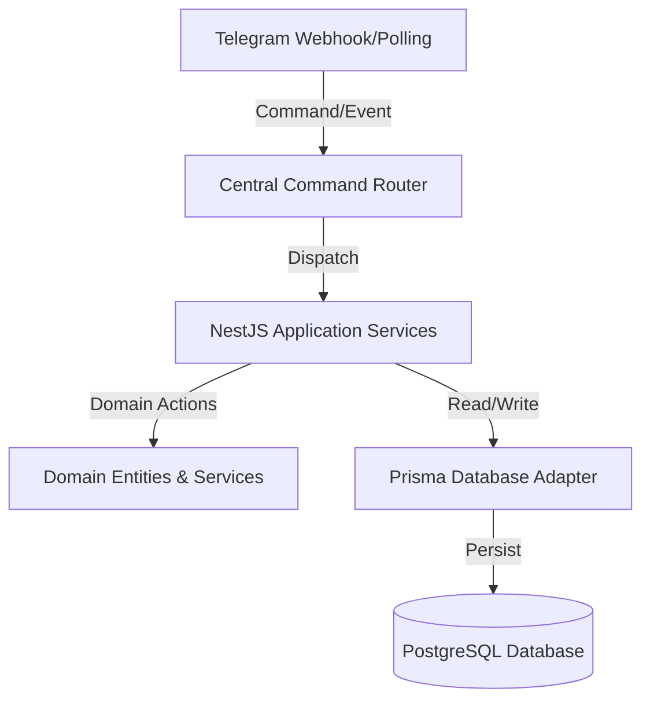

# 🚀 DevMate — The Telegram-based Personal Operating System

[](https://www.typescriptlang.org/)
[](https://nestjs.com/)
[](https://www.prisma.io/)
[](https://www.postgresql.org/)
[](https://telegraf.js.org/)

**DevMate** is a unified **Personal Operating System (POS)** that leverages Telegram as its primary, low-friction command interface. The platform is designed to consolidate a user's digital life—encompassing daily productivity, private finance, document utility, secure credentials, and collaborative expense splitting—into a single, secure, and responsive interface.

---

## 📖 Table of Contents
- [🌟 Key Features](#-key-features)
- [🏗️ System Architecture](#️-system-architecture)
- [📁 Repository Structure](#-repository-structure)
- [🚀 Getting Started](#-getting-started)
- [🛠️ Configuration & Environment](#️-configuration--environment)
- [📊 Database Setup & Seeding](#-database-setup--seeding)
- [🤖 Telegram Commands Reference](#-telegram-commands-reference)

---

## 🌟 Key Features

### 📅 1. Personal Management Module (PMM)
- **Notes Capture:** Create, read, update, and delete (CRUD) plain text and rich markdown notes via text commands or interactive buttons.
- **Todo & Tasks:** Manage tasks with priorities (`Low`, `Medium`, `High`), statuses (`Pending`, `In-Progress`, `Completed`), and due dates.
- **Goals Tracker:** Set long-term objectives with measurable sub-tasks, progress bars (calculated dynamically), and target completion dates.
- **Reminders Engine:** One-time or recurring reminders (using `rrule` timezone-aware parsing). Supports snooze, dismiss, skip, repeat, complex recurring rules, and missed reminder handling.
- **Birthday Manager:** Store contacts' birthdays with auto-scheduled notification alerts (1 week before, 1 day before, and day-of).
- **Internal Calendar:** Display daily schedules and agendas via the Telegram interface.

### 💰 2. Finance Module (FM)
- **Expense & Income Tracker:** Log expenses (`/exp 12.50 coffee`) and income with categories, recurring options, subscriptions, loans, and EMI tracking.
- **Budget Tracking:** Establish monthly spending limits per category and receive notifications when spending reaches warning and critical thresholds.
- **Currency Converter:** Convert foreign currency logs automatically using daily updated exchange rates against your base currency.
- **Financial Reports:** Generate text summaries and visual analytics charts rendered as images directly in the chat.

### 👥 3. Expense Splitter Module (ESM)
- **Group Management:** Generate secure, time-bound join links for Telegram users to join an expense sharing group.
- **Splitting Strategies:** Distribute expenses evenly, by custom percentages (totaling 100%), or exact decimal allocations.
- **Debt Settlement:** Automatically calculates the absolute minimum number of payments required to settle all group debts using the **Simplifying Debts** (Splitwise-like) algorithm.
- **Payment Ledger:** Record manual payment transactions to resolve outstanding balances.

### 🔒 4. Personal Vault Module (PVM)
- **Enterprise-Grade Security:** Server-side encryption for secure notes, credentials, and passwords.
- **Key Management:** Encrypted at-rest storage with rotation mechanisms (Data Encryption Keys / Key Management).

---

## 🏗️ System Architecture

DevMate is built as a **Modular Monolith** using **NestJS**, adhering to clean architecture and hexagonal boundaries:

- **Presentation Decoupling:** Core business logic is isolated from the communication channel (Telegram). This allows future clients (Web dashboards, Mobile apps, or Telegram Mini Apps) to connect to the same application services without core code refactoring.
- **Prisma & PostgreSQL:** Strong relational schema mapping outbox patterns, auditing logs, vaults, budgets, splitters, calendars, and users.
- **Transactional Outbox Pattern:** Ensures high-reliability event-driven communication (e.g., triggering reminders and dispatching notifications) even in case of transient database connection drops.

### Architecture Data Flow


---

## 📁 Repository Structure

```text
DevMate/
├── prisma/                  # Prisma Database schema and migration scripts
│   ├── schema.prisma        # 89KB+ Comprehensive database layout
│   └── seed/                # Seed scripts for initial databases setup
├── src/
│   ├── auth/                # Session, passwords, JWT, and Telegram auth services
│   ├── calendar/            # Event recurrence, conflicts, and calendar controls
│   ├── common/              # Global filters, interceptors, logger, middlewares
│   ├── config/              # Safe configuration loading & Zod schema validation
│   ├── database/            # Prisma module and service wrapper
│   ├── events/              # Event dispatcher & Transactional Outbox pattern
│   ├── finance/             # Expense/Income tracking, loans, budgets, reports
│   ├── notes/               # Markdown notes domain and services
│   ├── rbac/                # Role-Based Access Control (Permissions/Roles)
│   ├── reminders/           # Scheduler engine, recurrence executor, reminders
│   ├── splitter/            # Group expense splitter & debt simplifier
│   ├── telegram/            # Bot gateway, Wizard states, keyboard/message builders
│   ├── todo/                # Tasks, history, dependency logic, and CLI commands
│   ├── users/               # Profile, preferences, and settings management
│   ├── vault/               # Personal secure vault, key rotation, local providers
│   └── main.ts              # NestJS Application entry point
├── package.json             # App dependencies & run scripts
└── tsconfig.json            # TypeScript compile configurations
```

---

## 🚀 Getting Started

### Prerequisites
- **Node.js** (v20.x or higher)
- **PostgreSQL** (v15.x or higher)
- **pnpm** (preferred) or **npm**

### Installation
1. Clone the repository:
   ```bash
   git clone git@github.com:divyanshubochiwal04/DevMate.git
   cd DevMate
   ```
2. Install dependencies:
   ```bash
   npm install
   # or
   pnpm install
   ```

---

## 🛠️ Configuration & Environment

Create a `.env` file in the root directory by copying the example environment file:
```bash
cp .env.example .env
```

Configure the following key environment variables:
- **`DATABASE_URL`**: Your PostgreSQL connection string.
- **`TELEGRAM_BOT_TOKEN`**: The API token from Telegram's [@BotFather](https://t.me/BotFather).
- **`JWT_SECRET`**: Secure key for session token signing.
- **`VAULT_MASTER_KEY`**: Base key for vault credential encryption.

---

## 📊 Database Setup & Seeding

1. Run database migrations to apply the schema:
   ```bash
   npx prisma migrate dev
   ```
2. Seed the database with initial configurations, roles, permissions, and test data:
   ```bash
   npm run seed
   ```

---

## 🏃 Running the Application

### Development Mode
Start the development server with live reload:
```bash
npm run dev
```

### Production Mode
Build the project and start the server:
```bash
npm run build
npm run start
```

---

## 🤖 Telegram Commands Reference

Below are some of the main interactive command patterns supported by DevMate in the Telegram chat interface:

| Command | Action | Example |
| :--- | :--- | :--- |
| `/todo` | Manage checklist, add tasks, and list pending tasks. | `/todo Buy groceries` |
| `/reminder` | Set timezone-aware reminders (supports relative strings). | `/reminder Coffee in 15 mins` |
| `/expense` | Log financial outgoings against target category. | `/expense 450 Dinner` |
| `/income` | Log salary, freelance, or investment incoming cash flow. | `/income 50000 Salary` |
| `/split` | Trigger the expense sharing wizard inside a group chat. | `/split 120 Pizza @User1 @User2` |
| `/settle` | Check group settlements and outstanding simplified debts. | `/settle` |
| `/vault` | Open the secure vault to store passwords or tokens. | `/vault login github` |

---

## 📄 License
Licensed under the [ISC License](LICENSE).
