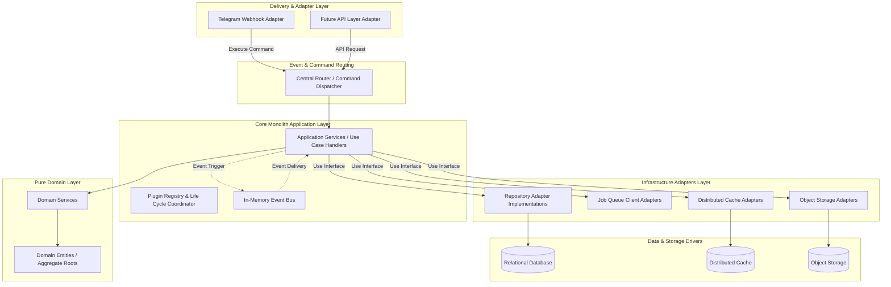
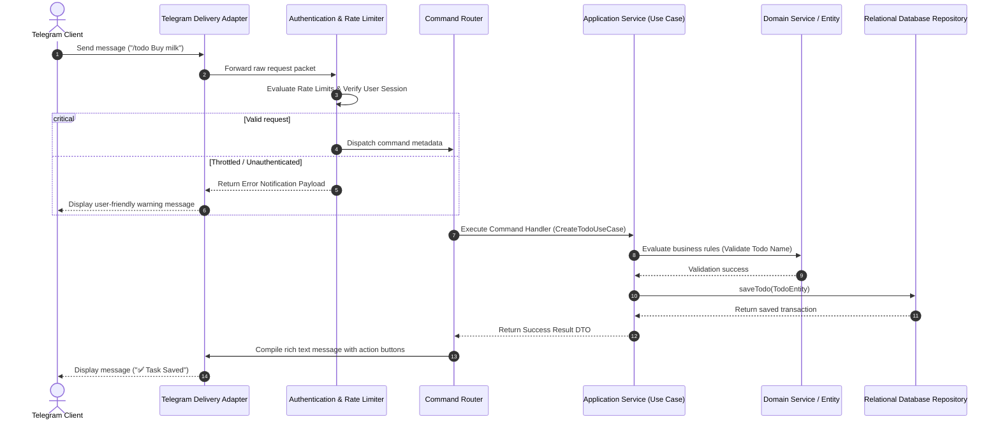
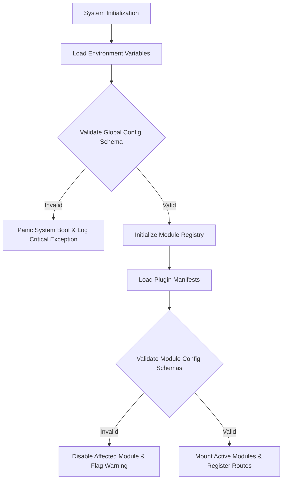
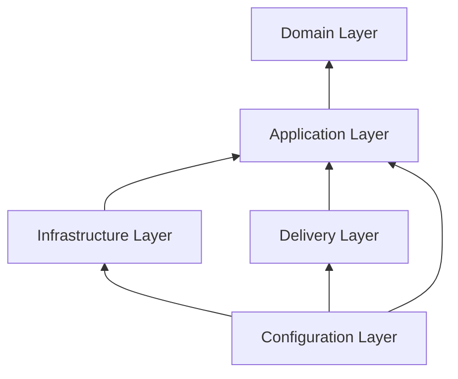
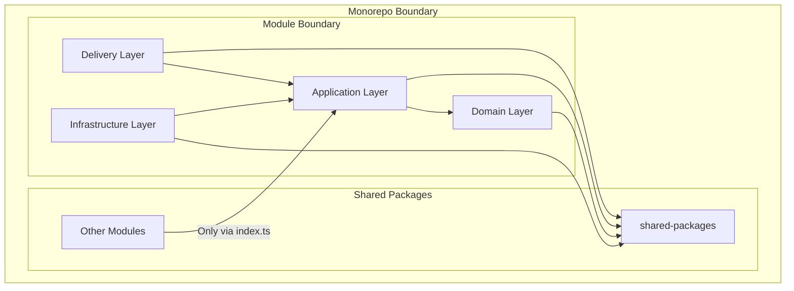
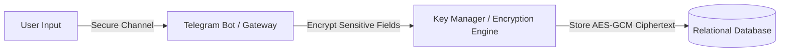

# Software Architecture Document (SAD)
## Project Name: DevMate — The Telegram-based Personal Operating System

---

## 1. Executive Summary & Context

This Software Architecture Document (SAD) defines the technical architecture for the DevMate Personal Operating System. Based on the approved Product Requirements Document (PRD) and Functional Specification Document (FSD), this document establishes the engineering rules, structural patterns, and component boundaries. 

The primary design goal is to build a **Telegram-first** modular monolith using clean, hexagonal, and plugin-based architectures that decouple domain business rules from external delivery frameworks, storage adapters, and system tools. This ensures future expansions (such as Telegram Mini Apps, Web Dashboards, or mobile interfaces) can be implemented without refactoring core domain services.

---

## 2. Architecture Diagrams

### 2.1 High-Level Architecture Diagram



### 2.2 Request Lifecycle



### 2.3 Configuration Flow Diagram



---

## 3. Architecture Principles

### 3.1 Separation of Concerns (SoC)
The system separates technical concerns (data access, serialization, network delivery) from business concerns (calculating budget thresholds, evaluating habit streaks). This ensures changes to infrastructure do not cascade changes into business rules.

### 3.2 Single Responsibility Principle (SRP)
Every class, service, and data object in the system must have exactly one reason to change. Rather than creating multi-purpose "God Services", functionality is decomposed into small, single-action use case classes.

### 3.3 Dependency Inversion Principle (DIP)
High-level business rules must not depend on low-level utility adapters. Business domain layers define their own abstractions (Interfaces/Ports) for data access or file uploading. The infrastructure layer implements these interfaces (Adapters). Dependencies flow inward toward the domain layer.

### 3.4 Open/Closed Principle (OCP)
The platform core must be open for extension but closed for modification. New functional capabilities should be added by writing new plugins that adhere to standard interfaces, without modifying existing core routing files.

### 3.5 Feature-First Architecture
The monorepo organizes code around cohesive business domains (e.g., `modules/expense-splitter`) rather than technical archetypes. This limits coupling and permits independent feature isolation.

### 3.6 Hexagonal Architecture (Ports and Adapters)
Core application services interact with outer layers strictly via inbound ports (command dispatch interfaces) and outbound ports (repository and service contracts). This decouples business logic from delivery adapters.

### 3.7 Interface-Driven Design
All communication across module boundaries and infrastructure bounds operates strictly via interfaces, ensuring implementation implementations remain easily mockable and interchangeable.

---

## 4. Layered Architecture & Communication Rules

DevMate implements a strict layered architecture pattern. Code in a given layer is permitted to import code only from layers below it. Outward dependencies (importing from higher layers) are strictly prohibited.



### 4.1 Delivery Layer
* **Responsibilities:** Translate external interface events (Telegram webhooks, API requests) into internal commands and dispatch them. Reassemble internal DTO responses into channel-specific formats.
* **Forbidden Actions:** Must not contain business rules, execute database queries directly, or reference repository implementations.

### 4.2 Application Layer
* **Responsibilities:** Coordinate use cases, manage application state transitions, orchestrate transactions, and dispatch domain events.
* **Forbidden Actions:** Must not import delivery adapters, serialize data for external channels, or write database-specific queries.

### 4.3 Domain Layer
* **Responsibilities:** Model business rules, evaluate domain entities, check state invariants, and enforce business calculations.
* **Forbidden Actions:** Must not reference any database, framework, file storage, or external API interfaces. It must remain 100% pure software architecture code.

### 4.4 Infrastructure Layer
* **Responsibilities:** Implement outbound application ports, manage database connections, upload files to object storage, write application logs, and publish messages to external queues.
* **Forbidden Actions:** Must not define business rules or initiate transaction lifecycles without application layer coordination.

### 4.5 Configuration Layer
* **Responsibilities:** Load environment configurations, validate variables, bootstrap modules, and resolve system dependencies.
* **Forbidden Actions:** Must not implement business logic.

---

## 5. Monorepo Architecture

The DevMate platform is organized within a monorepo structure. The structure enforces isolation and high-velocity developer experience (DX).

### 5.1 Monorepo Layout and Top-Level Directory Responsibilities

* **`/apps`**: Houses deployment-specific entry point applications.
  * `apps/telegram-bot`: The primary executable bootstrap application configuring the Telegram bot webhook gateway.
  * `apps/cli-admin`: System administration CLI tools.
* **`/packages`**: Shared internal libraries distributed across the monorepo apps and modules. Contains standard systems, structures, and shared packages.
* **`/modules`**: Feature domains behaving as independent plugins.
* **`/infrastructure`**: Infrastructure-as-code manifests, deployment configurations, and runtime container variables.
* **`/scripts`**: Automation utilities for monorepo setups, verification tasks, and migration runners.
* **`/docs`**: Functional and technical specifications, architecture schemas, and developer guides.
* **`/configs`**: Global application configuration templates, environment files, linting configurations.
* **`/tooling`**: Internal developer scripts, custom code generators, static dependency analyzers.
* **`/templates`**: Boilerplates for creating new modules and scaffolding code.
* **`/docker`**: Dockerfiles and container configurations for local developer orchestration.
* **`/.github`**: GitHub Action workflows for continuous integration validation.
* **`/deployment`**: Production build configurations, orchestration templates.
* **`/observability`**: Monitoring dashboard configs, trace routing, alert triggers.

---

## 6. Shared Packages (`/packages` or `/shared`)

To support clean reuse without circular imports, code shared across modules resides in isolated packages:

* **`shared-types`**: Core type representations, interface declarations, and standard primitives.
* **`shared-contracts`**: Standardized system interfaces and ports (e.g., base repository abstractions).
* **`shared-events`**: Event structures and integration event schemas used in cross-module communications.
* **`shared-errors`**: Global exceptions hierarchy, error structures, and user-safe mappings.
* **`shared-config`**: Global configuration parser and settings loading utilities.
* **`shared-validation`**: Common validation schemas, inputs decorators, and assertions.
* **`shared-logging`**: Structured log formatters, correlation ID utilities, and output interfaces.
* **`shared-security`**: Hash checkers, sanitization libraries, and access guard contracts.
* **`shared-storage`**: Common file storage ports, directory templates, and upload parameters.
* **`shared-notifications`**: Shared payload templates and dispatcher requirements for alert delivery.
* **`shared-utils`**: Common utility helper functions (e.g., date translations, math rounders).
* **`shared-constants`**: System-wide enums, constants, and error codes.
* **`shared-testing`**: Mock repository utilities, test execution wrappers, and database seeders.

---

## 7. Folder Structure (Directory Layout)

```
/devmate-monorepo/
├── apps/
│   └── telegram-bot/
│       ├── src/
│       │   ├── bootstrap/      # Bootstraps configuration and routes
│       │   └── main.ts         # Executable server entry point
│       └── package.json
├── packages/
│   ├── contracts/             # Core interfaces and shared ports
│   │   ├── src/
│   │   │   ├── event-bus.interface.ts
│   │   │   └── repository.interface.ts
│   │   └── package.json
│   ├── crypto/                # Server-side encryption helper library
│   │   └── package.json
│   └── testing/               # Shared testing tools
│       └── package.json
├── modules/
│   └── [feature-name]/        # Feature Domain folder (e.g., expense-splitter)
│       ├── manifest.json      # Module properties and dependencies
│       ├── domain/            # Pure business entities and services
│       │   ├── entities/
│       │   └── services/
│       ├── application/       # Command/Query use-case handlers and ports
│       │   ├── commands/
│       │   ├── queries/
│       │   └── ports/
│       ├── infrastructure/    # Database maps and storage adapters
│       │   └── persistence/
│       ├── delivery/          # Channel-specific input controllers
│       │   └── telegram-commands/
│       └── index.ts           # Entry point exposing the public interface
├── infrastructure/            # System container parameters
├── scripts/                   # Workspace automation scripts
├── package.json               # Monorepo configuration mapping dependencies
└── tsconfig.json              # Typings configurations
```

---

## 8. Feature Module Blueprint

Every feature module inside the `/modules` directory must be structured according to a single architectural blueprint:

```
modules/[module-name]/
├── README.md                  # Documentation of module capabilities and features
├── manifest.json              # Module configuration metadata and dependencies
├── index.ts                   # Entry point exporting Public Contracts
├── domain/                    # Core Domain Layer
│   ├── entities/              # Domain Models / Aggregate Roots
│   ├── services/              # Domain Business Services
│   └── policies/              # Business rules evaluated on events
├── application/               # Application Layer
│   ├── commands/              # Use cases that mutate state
│   ├── queries/               # Use cases that read state
│   ├── ports/                 # Outbound interfaces (Internal Contracts)
│   ├── validators/            # Command/Query input validators
│   └── dtos/                  # Data Transfer Objects
├── infrastructure/            # Infrastructure Layer
│   ├── persistence/           # Database repositories implementations
│   └── external/              # External service adapters
├── delivery/                  # Delivery Layer
│   └── telegram-commands/     # Chat command parsers and UI handlers
└── tests/                     # Test Suite
    ├── unit/
    ├── integration/
    └── contract/
```

### 8.1 Module Contracts
* **Public Contracts:** Exported from `index.ts`. Defines commands, queries, and integration events other modules can consume. No internal classes (entities, database adapters) are permitted to be exported.
* **Internal Contracts:** Declared in the `application/ports` folder. Interfaces that describe infrastructure requirements (e.g., `IRepository`), implemented by the infrastructure layer.

---

## 9. Dependency Rules & Boundaries

To prevent coupling and maintain feature isolation, the following boundary rules are statically enforced:



### 9.1 Allowed Imports
- Code within a module can import from layers beneath it (Delivery $\rightarrow$ Application $\rightarrow$ Domain).
- Any layer can import configurations and utilities from the `shared-*` packages.
- Cross-module communication is permitted *only* via the public `index.ts` file of the target module.

### 9.2 Forbidden Imports
- **Domain** must never import from **Application**, **Infrastructure**, or **Delivery**.
- **Application** must never import from **Infrastructure** or **Delivery**.
- Direct import of files inside another module's sub-folders (e.g., `../other-module/domain/entities`) is blocked.
- Modules must never import database configuration parameters of other modules.

---

## 10. Plugin Manifest & Registry System

To support a highly modular system, every feature module behaves like an independent plugin.

### 10.1 Plugin Manifest (`manifest.json`)
The manifest defines the plugin integration constraints:
- **`pluginId`**: Unique string identifier (e.g., `devmate.expense-splitter`).
- **`displayName`**: Human-readable name shown in administration panels.
- **`description`**: Summary of plugin features.
- **`author`**: Organization or developer identifier.
- **`version`**: Semantic versioning string (e.g., `1.0.0`).
- **`compatibility`**: Core platform version constraints (e.g., `^1.2.0`).
- **`dependencies`**: Map of required plugin IDs and their compatible versions.
- **`optionalDependencies`**: Plugin IDs that extend behavior if present but do not block load if absent.
- **`permissions`**: Access scopes requested by the module (e.g., `database:write`, `files:read`).
- **`capabilities`**: Hooks or features the plugin provides to the system (e.g., `currency-provider`).
- **`commands`**: Array of bot command triggers and description blocks.
- **`events`**: Integration events the plugin publishes or consumes.
- **`configuration`**: Validation schemas for environment variables required by the plugin.
- **`healthChecks`**: Targets evaluated during system checks.
- **`migrationVersion`**: Integer version tracking database schema migrations.
- **`lifecycleHooks`**: Callback handlers for installation, start, stop, update, and uninstall operations.

### 10.2 Plugin Lifecycle Operations
* **Installation:** Registry validates manifest schemas, checks compatible parameters, runs database migration scripts up to `migrationVersion`, and registers configuration parameters.
* **Registration:** Registers command hooks and routing definitions in the core system router.
* **Initialization:** Instantiates background scheduler tasks, hooks active event listeners, and mounts database connections.
* **Enable/Disable:** Feature flags toggle the active routing status of the plugin commands and scheduler tasks without purging database records.
* **Upgrade:** Compares manifest version numbers, executes version-specific database migration files sequentially, and updates configuration schemas.
* **Uninstall:** Unregisters commands and event listeners, runs rollback migrations, and removes module assets.

---

## 11. Configuration Architecture

The system enforces a unified hierarchy for configuration variables:

```
[Level 5] Runtime Configurations (Highest Priority - Database Overrides)
    ↓
[Level 4] Secret Vault Variables
    ↓
[Level 3] Environment Variables
    ↓
[Level 2] Global Default Files
    ↓
[Level 1] Module-Specific Defaults (Lowest Priority)
```

### 11.1 Secret Management
* Raw credentials (passwords, bot tokens, API keys) must never be written to code or config templates.
* Secrets are loaded from the runtime environment or a secure secret manager and validated immediately at system startup.

### 11.2 Configuration Validation
* The configuration layer validates variables against schema definitions during bootstrap. Any invalid variable or configuration mismatch triggers a system panic and aborts start.

---

## 12. Logging, Metrics & Observability

Observability tracks transaction lifecycles, health metrics, and audit records.

### 12.1 Structured Logging & Correlation
* All log entries are written in structured format (e.g., JSON) to standardize ingestion across tracking tools.
* Log entries must contain a unique **Correlation ID** and **Trace ID** generated on request ingress. This ID propagates across thread contexts and background task queues to trace execution lifecycles.

### 12.2 Observability Classifications
* **Application Logs:** Diagnostic statements categorized by log level (`DEBUG`, `INFO`, `WARN`, `ERROR`, `FATAL`).
* **Audit Logs:** Immutable logs recording user actions (e.g., creating a goal, updating group split parameters).
* **Security Logs:** Records of auth failures, rate limit blocks, and vault access flags.
* **Performance Logs:** Traces monitoring execution latency of database repositories and background operations.

### 12.3 System Health Checks
* Modules expose health checks (verifying database connectivity, third-party API availability) evaluated periodically by a central health checker.

---

## 13. Background Processing

Background operations run asynchronously via background job queues, ensuring webhook delivery remains unblocked.

### 13.1 Task Processing Rules
* **Task Categories:** Reminders scheduler, OCR pipelines, PDF merges, database backups, cleanups.
* **Scheduling:** Tasks are scheduled based on timezone-translated cron expressions.
* **Idempotency:** Tasks evaluate an execution key (deduplication identifier) before run.
* **Retries & Backoff:** Failed queue tasks are retried using a structured retry count with exponential backoff configurations.
* **Dead Letter Queue (DLQ) Handling:** If a task exceeds its maximum retry threshold, it is moved to a Dead Letter queue, marked with error logs, and system administrators are alerted.
* **Timeouts & Cancellation:** Every task runs with a strict execution timeout. Workers listen to cancellation tokens to abort tasks immediately if requested.

---

## 14. Database Architecture (Decoupled Persistency)

DevMate utilizes database abstraction rules to keep modules independent of database drivers.

### 14.1 Repository Boundaries
* Every database entity is owned exclusively by a single module. 
* Modules write and retrieve data strictly via Repository interfaces declared in the module's application layer.
* Database transaction lifecycles must be orchestrated by the application use case layer using unit-of-work patterns, bypassing infrastructure implementation details.

### 14.2 Migrations & Versioning
* Each module contains a folder for its own database migration scripts (e.g., `infrastructure/persistence/migrations`).
* Database migrations are executed sequentially by the configuration layer during startup, matching database version state tables.

### 14.3 Soft Delete & Audit Strategy
* Deleting a record updates a `deletedAt` timestamp (Soft Delete) rather than executing a hard delete, preserving historical logs for financial ledger modules.
* Critical entities (e.g., expenses, user profiles) incorporate audit stamps (`createdAt`, `updatedAt`, `modifiedBy`) populated automatically by the database layer.

---

## 15. Security Architecture

### 15.1 Authentication & Request Authorization
* **Telegram Signature Verification:** The entry controller validates incoming Telegram webhook requests by verifying security hash signatures against bot tokens before processing commands.
* **Role-Based Access Control (RBAC):** Group splitter ledgers and file repositories verify active user membership scopes before executing edit or retrieval operations.

### 15.2 Encryption Boundaries



* **Server-Side Encryption:** Sensitive credentials (Vault payloads, password files) are encrypted at rest using industry-standard symmetric encryption algorithms (AES-256-GCM).
* **Decoupled Key Management:** Keys are sourced from environment secrets or dedicated Key Management Services, separated from relational databases.

### 15.3 Rate Limiting
* Webhook routing layers enforce a sliding-window rate limit per Telegram User ID to prevent denial-of-service attempts.

---

## 16. Naming Conventions

To maintain consistency, all codebase elements must strictly adhere to the following naming conventions:

### 16.1 Code Elements
* **Files:** kebab-case matching the class structure (e.g., `create-todo.use-case.ts`).
* **Folders:** kebab-case (e.g., `expense-splitter`).
* **Classes:** PascalCase ending with the component archetype (e.g., `LogExpenseUseCase`, `TodoRepository`).
* **Interfaces:** PascalCase prefixed with `I` (e.g., `ITodoRepository`, `IEventBus`).
* **DTOs:** PascalCase ending with `Dto` (e.g., `CreateTodoRequestDto`).
* **Events:** PascalCase ending with `Event` (e.g., `ExpenseLoggedEvent`).
* **Commands:** PascalCase ending with `Command` (e.g., `UpdateSettingsCommand`).
* **Services:** PascalCase ending with `Service` (e.g., `CurrencyConversionService`).
* **Enums & Constants:** UPPER_SNAKE_CASE (e.g., `TASK_STATUS_PENDING`).

### 16.2 Database Elements
* **Tables:** snake_case, pluralized (e.g., `user_profiles`, `expense_transactions`).
* **Indexes:** `idx_[table_name]_[column_name]` (e.g., `idx_user_profiles_telegram_id`).
* **Constraints:** `fk_[table_name]_[ref_table]_[column_name]` (e.g., `fk_expenses_groups_group_id`).

---

## 17. Testing Architecture

DevMate implements a strict pyramid testing strategy:

```
      / \
     /   \     E2E / System Tests (Integrate Bot Controllers)
    /     \
   /-------\
  /         \   Module / Contract Tests (Validate boundary interfaces)
 /-----------\
/             \  Unit & Integration Tests (95% Core Service coverage)
/_______________\
```

### 17.1 Test Boundaries
* **Unit Tests:** Execute in-memory with zero network or database connections. All infrastructure boundaries are mocked using interface-driven contracts.
* **Module / Contract Tests:** Verify integration endpoints and event contracts between plugins.
* **End-to-End (E2E) Tests:** Execute automated scripts simulating message dispatches and verify final database states.

---

## 18. CI/CD Pipeline & Quality Gates

The CI/CD pipeline enforces the monorepo constraints.

### 18.1 Pipeline Execution Steps
1. **Linting & Formatting:** Verifies code styling guidelines.
2. **Static Analysis:** Runs circular dependency checks and verifies module boundaries using dependency check utilities.
3. **Security Scan:** Analyzes dependencies for vulnerabilities and scans code for hardcoded secrets.
4. **Testing Suite:** Executes the test suite. Builds are rejected if unit test coverage drops below target boundaries.
5. **Build Generation:** Builds delivery bundles and packages.

---

## 19. File Size Policy & Code Splitting

To prevent the emergence of God Classes, the codebase enforces strict size limits:

### 19.1 Size Metrics
* **Ideal Size:** 150 to 250 Lines of Code (LOC).
* **Warning Boundary:** 300 LOC.
* **Hard Block Limit:** 500 LOC (CI static analysis step automatically fails builds if any single file exceeds 500 lines).

### 19.2 Splitting Strategies
* **UseCase Decomposition:** Split multi-function services into discrete single-function files (e.g., `CreateTodoUseCase.ts`, `UpdateTodoUseCase.ts`).
* **Adapter Separation:** Separate repository queries into custom sub-repository modules rather than compiling all queries inside a single global database adapter.

---

## 20. Engineering Handbook

### 20.1 Architectural Decision Records (ADR)
* Significant changes to architectural boundaries or infrastructure interfaces must be proposed via an Architecture Decision Record (ADR) stored inside `/docs/adr` before implementation.

### 20.2 Request For Comments (RFC)
* Designing new module capabilities or core contracts requires submitting a Request for Comments (RFC) document to ensure team alignment on interfaces and data types.

### 20.3 Git Branching Strategy
* The repository uses trunk-based development.
* Developers commit to feature branches (`feature/[module-name]/[description]`) and merge to `main` via pull requests.

### 20.4 Commit Message Format
All commit messages must follow the Conventional Commits structure:
```
<type>(<module>): <description>

[optional body]

[optional footer(s)]
```
* **Types:** `feat` (new feature), `fix` (bug fix), `refactor` (code restructuring), `test` (adding tests), `chore` (build updates).
* **Example:** `feat(finance): add EMI amortization calculation use case`

### 20.5 Definition of Done (DoD)
A feature task is committed as "Done" only when:
* Code compiles cleanly with zero linting warnings.
* Files do not exceed the 500-line hard limit.
* Static analysis verifies zero circular dependencies.
* Unit test coverage targets are satisfied.
* Pull requests are approved by at least one peer.

### 20.6 Versioning & Deprecation Policy
* Releases must follow Semantic Versioning (SemVer).
* Old APIs and contracts must be marked with deprecation flags and retained for at least two minor release versions before deletion.
* Backward compatibility must be verified before merging breaking schema updates.

### 20.7 Feature Flag Policy
* All new modules must be hidden behind runtime feature flags during development, allowing safe integration of code into the main branch.
